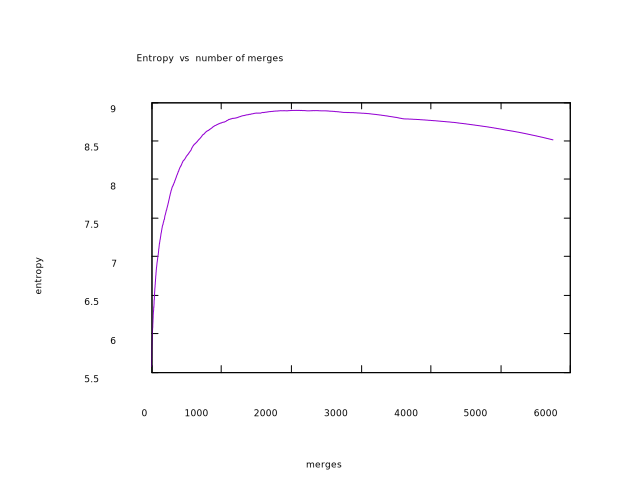

This is experimental project (the algorithm is emerging in permanent experiments with text tokenization).

The main idea is similar to the Byte Pair Encoding tokenizer: 
https://arxiv.org/pdf/1508.07909.pdf - 	the original article; 
https://leimao.github.io/blog/Byte-Pair-Encoding/ - some Python implementations. 
Here the implementation is in Rust. 

The BPE idea: 
We have a text and split it in words: the result is vocabulary of: (word,frequency of the word in the text). 
Initial tokens are characters (more general unicode scalars). We split all words in
vocabulary to the characters (initially).
At every step we find the most frequent pair of consequtive tokens in our vacabulary replace the most frequent pair with the new token. The token is the glued pair of most frequent tokens. 

The 'Alice's Adventures in Wonderland by Lewis Carroll' from Gutenberg project is used here : 
http://www.gutenberg.org/ebooks/11 as the text.


The BPE tokenizer was initially invented for splitting of a rare words to more usual components. But in the project I try to use it as a universal algorithm for tokenization of a text to basic tokens, which may be considered as a basis for vectorization of the text: the basic tokens we find will be the basis (orthogonal) for the text vectorization. This is the program. 


We start from something similar to 'characters' (like scalar unicodes or graphemes). The good point: all words are splitted in chars : dog => 'd o g' , cat => 'c a t'. Not a good point: characters are very unspesific , and if the chars will be our basis vectors the 'bag of chars' will not work: 'd o g' and 'g o d' will be the same vectors if we will try to represent the words as sum of basis vectors 'd' , 'o', 'g'. 

On the other edge of the tokenization process we will have as our tokens the very initial words: 'alice', 
'her', 'head' etc.... will be same time the initial words and out basis vectors. It is some kind of 'one hot encoding'. Bag of words model is working trivially : word 'alice' is represented as vector 'alice'; 'her' => will be our basis vector 'her'.  There is always one token in the bag. 
Here we have another problem : the vectors are too specific. 'dog' and 'dogs' are different vectors, even there is an intuitive filling the 'dogs' is something like a bag of 'dog' and 's'. We will have very big vocabulary of of basic words-tokens (our basis vectors) without any natural reflection of relations of the words. We declare as ''basis' (or basic) actually what is not a basic because of the internal relations , which we ignore. 

Let us return to the chars. The chars at the beginning , end and inside a word behave differently. And if we have a standalone I it is not the same as 'i' at the beginning or end of a word. Let us use 'modifiers'. Modifiers are not a tokens, but they will 'decorate' a characters as a rudimentary type system: 
"🔺","🔸","🔹","🔻"

The '🔺d🔹o🔹g🔻' and '🔺g🔹 o🔹 d🔻'  ==> now 'd🔻' and '🔺d' are different basis tokens corresponding to 
the characters at the beginning or end of words.   
By two blue diamonds (like'🔹o🔹') we will modify the internal characters. 'd🔻' ; '🔺d' and '🔹 d🔹' are different basis tokens now (different basis vectors). (We use emoji as the modifiers).   
The two '🔹' from every side of a token are used in part for not to use 'lookaround' in regex.
And 'i🔻' ; '🔺i' ; '🔹 i🔹' ; '🔺i🔻' all are different tokens too. 
The tokens at the beginning , end , internal of a word all have very different merging statistic within the process of tokenization. We have to handle them differently and the modifiers help with this. 

Intuition we will use: 
-1.Tokens are resourses. The resourses may merge and produce another resourses : new tokens.  
-2.The merging process is similar to logical derivation rules. But the rules are not 'ad hoc' determened 
but emerge in the global process of calculation of most frequent pairs. The logic emerges from the statistics of 
our text.
-3.The resourses (tokens) are the building blocks of our words.  
-4.The building blocks, the GENERATED tokens may be considered as basis vectors of our system.  
-5.The quantity of possible tokens is VERY HUGE. If we use about 100 characters (unicode scalars) 
in our words and words up to the length 10 chracters in out texts: the number of possible words is more than 10 in power 20.
-6.The number of words and building blocks which are IN REALITY used for words building is VERY SMALL (in comparison 
with the all possible 'words').
-7.All words in the sample text are generated within about 6000 merges, so, we have max up 
to 6000 'building tokens'. 
-8.Modifiers may be considered as a rudimentary type system or as a rudimentary "positional" encoding.  

Because of technical reasons (to simplify the search of a tokens, not to use ''lookaround' but a simple regex ) within the course of merges the words are represented like this: 

"  🔺a  🔹d🔹  🔹v🔹  🔹e🔹  🔹n🔹  🔹t🔹  🔹u🔹  🔹r🔹  🔹e🔹  s🔻  "  <=== two empty spaces are inserted 
between every pair of modified tokens and at the end and beginning of a word.

If at some merge 🔹e🔹  🔹n🔹  pair will merges, we will get : 
"  🔺a  🔹d🔹  🔹v🔹  🔹e🔹🔹n🔹  🔹t🔹  🔹u🔹  🔹r🔹  🔹e🔹  s🔻  "
If at some merge 🔺a  🔹d🔹 are to be merged (as most frequent pair), we will get:
"  🔺a🔹d🔹  🔹v🔹  🔹e🔹  🔹n🔹  🔹t🔹  🔹u🔹  🔹r🔹  🔹e🔹  s🔻  "

Let us take some 'familiar' and 'not familiar' words for the 'Alice ...' text.
Familiar means some words from the 'Alice.....' text like : 'forgetting' , 'alice', 'yourself', 'consented'.
Not familiar, for example: 'coronavirus', 'tokenization', 'antidisestablishmentarianism', 'hippopotomonstrosesquippedaliophobia'.  

We wil tokenize the words : 
-1.In case the system did just 2 merges (still just characters are out tokens).
-2.In case of all tokens are merged in original words (about 6000 merges for the text).

For only 2 merges, the tokens are mostly 'decorated characters': 
```
=================================
forgetting : ["🔺f", "🔹o🔹", "🔹r🔹", "🔹g🔹", "🔹e🔹", "🔹t🔹", "🔹t🔹", "🔹i🔹", "🔹n🔹", "g🔻"]
alice : ["🔺a", "🔹l🔹", "🔹i🔹", "🔹c🔹", "e🔻"]
yourself : ["🔺y", "🔹o🔹", "🔹u🔹", "🔹r🔹", "🔹s🔹", "🔹e🔹", "🔹l🔹", "f🔻"]
consented : ["🔺c", "🔹o🔹", "🔹n🔹", "🔹s🔹", "🔹e🔹", "🔹n🔹", "🔹t🔹", "🔹e🔹", "d🔻"]
inquisitively : ["🔺i", "🔹n🔹", "🔹q🔹", "🔹u🔹", "🔹i🔹", "🔹s🔹", "🔹i🔹", "🔹t🔹", "🔹i🔹", "🔹v🔹", "🔹e🔹", "🔹l🔹", "y🔻"]
coronavirus : ["🔺c", "🔹o🔹", "🔹r🔹", "🔹o🔹", "🔹n🔹", "🔹a🔹", "🔹v🔹", "🔹i🔹", "🔹r🔹", "🔹u🔹", "s🔻"]
tokenization : ["🔺t", "🔹o🔹", "🔹k🔹", "🔹e🔹", "🔹n🔹", "🔹i🔹", "🔹z🔹", "🔹a🔹", "🔹t🔹", "🔹i🔹", "🔹o🔹", "n🔻"]
antidisestablishmentarianism : ["🔺a", "🔹n🔹", "🔹t🔹", "🔹i🔹", "🔹d🔹", "🔹i🔹", "🔹s🔹", "🔹e🔹", "🔹s🔹", "🔹t🔹", "🔹a🔹", "🔹b🔹", "🔹l🔹", "🔹i🔹", "🔹s🔹", "🔹h🔹", "🔹m🔹", "🔹e🔹", "🔹n🔹", "🔹t🔹", "🔹a🔹", "🔹r🔹", "🔹i🔹", "🔹a🔹", "🔹n🔹", "🔹i🔹", "🔹s🔹", "m🔻"]
hippopotomonstrosesquippedaliophobia : ["🔺h", "🔹i🔹", "🔹p🔹", "🔹p🔹", "🔹o🔹", "🔹p🔹", "🔹o🔹", "🔹t🔹", "🔹o🔹", "🔹m🔹", "🔹o🔹", "🔹n🔹", "🔹s🔹", "🔹t🔹", "🔹r🔹", "🔹o🔹", "🔹s🔹", "🔹e🔹", "🔹s🔹", "🔹q🔹", "🔹u🔹", "🔹i🔹", "🔹p🔹", "🔹p🔹", "🔹e🔹", "🔹d🔹", "🔹a🔹", "🔹l🔹", "🔹i🔹", "🔹o🔹", "🔹p🔹", "🔹h🔹", "🔹o🔹", "🔹b🔹", "🔹i🔹", "a🔻"]
========================
```
In the case the tokenizations for familiar and unfamiliar words are similar. 
Words of both types are splitted on 'decorated characters'.


After 5746 merges (all tokens are merged into original words) we have ( "❗" is used as "UNCNOWN" token):
```
======================
forgetting : ["🔺f🔹o🔹🔹r🔹🔹g🔹🔹e🔹🔹t🔹🔹t🔹🔹i🔹🔹n🔹g🔻"]
alice : ["🔺a🔹l🔹🔹i🔹🔹c🔹e🔻"]
yourself : ["🔺y🔹o🔹🔹u🔹🔹r🔹🔹s🔹🔹e🔹🔹l🔹f🔻"]
consented : ["🔺c🔹o🔹🔹n🔹🔹s🔹🔹e🔹🔹n🔹🔹t🔹🔹e🔹d🔻"]
inquisitively : ["🔺i🔹n🔹🔹q🔹🔹u🔹🔹i🔹🔹s🔹🔹i🔹🔹t🔹🔹i🔹🔹v🔹🔹e🔹🔹l🔹y🔻"]
coronavirus : ["❗"]
tokenization : ["❗"]
antidisestablishmentarianism : ["❗"]
hippopotomonstrosesquippedaliophobia : ["❗"]
========================
```

We may see the big difference. Familiar words are tokenized 'by itself'. And it is not a surprise , 
with the set of tokens the unfamiliar words all become "❗". The tokens can not match any of the 
words.

The number of the merges is hyperparameter in the system. The question is:
1.We use the "Alice...." text as a learning text for our system.
2.Our task is to find some reasonable tokenization for words even not from the very text where 
tokenization is more specific than just splitting to characters. 
3.We believe the "Alice..." text, as a 'big enought' sample of English text, has internal relations 
between subparts of the text (tokens) , which (in some approximation) reflect the general 
structure of English language. 
4.We believe, there exist a relation which is more illuminative than just splitting on 'characters'.
5.We believe , the relation is more general than just the tokens which correspond to the very set of 
all different words in the "Alice ..." text.

The question: how to find the hyperparameter?
Blow is the possible answer (and algorithm).  
At every stage of merge we have vocabulary of: (token:quantity of the token in the text). We may calculate the 
distribution => (token:frequency of the token in the text). For the distribution, we calculate the entropy. Within 
the process of tokenization the entropy grows and then decrease.   
Find the number of merge for the max entropy (NMAX).
Run the tokenization process from the beginning ('chars' stage) up to the NMAX. The vocabulary of tokens will be our 
final vocab of tokens. 
Let us see the plot (the process is run up to the end, 5746 merges). The max of entropy is at about 2000 merges.




The tokenization when Number of merges is 2079: 
```
==================================================
forgetting : ["🔺f🔹o🔹🔹r🔹🔹g🔹", "🔹e🔹🔹t🔹🔹t🔹🔹i🔹🔹n🔹g🔻"]
alice : ["🔺a🔹l🔹🔹i🔹🔹c🔹e🔻"]
yourself : ["🔺y🔹o🔹🔹u🔹🔹r🔹🔹s🔹🔹e🔹🔹l🔹f🔻"]
consented : ["🔺c🔹o🔹🔹n🔹", "🔹s🔹", "🔹e🔹🔹n🔹🔹t🔹🔹e🔹d🔻"]
inquisitively : ["🔺i🔹n🔹", "🔹q🔹🔹u🔹", "🔹i🔹🔹s🔹", "🔹i🔹🔹t🔹", "🔹i🔹", "🔹v🔹🔹e🔹🔹l🔹y🔻"]
coronavirus : ["🔺c🔹o🔹", "🔹r🔹🔹o🔹🔹n🔹", "🔹a🔹", "🔹v🔹", "🔹i🔹🔹r🔹", "🔹u🔹s🔻"]
tokenization : ["🔺t🔹o🔹", "🔹k🔹", "🔹e🔹🔹n🔹", "🔹i🔹", "🔹z🔹", "🔹a🔹🔹t🔹🔹i🔹🔹o🔹n🔻"]
antidisestablishmentarianism : ["🔺a🔹n🔹", "🔹t🔹", "🔹i🔹🔹d🔹", "🔹i🔹🔹s🔹", "🔹e🔹🔹s🔹🔹t🔹", "🔹a🔹🔹b🔹", "🔹l🔹", "🔹i🔹🔹s🔹🔹h🔹", "🔹m🔹", "🔹e🔹🔹n🔹🔹t🔹", "🔹a🔹🔹r🔹", "🔹i🔹", "🔹a🔹🔹n🔹", "🔹i🔹🔹s🔹", "m🔻"]
hippopotomonstrosesquippedaliophobia : ["🔺h🔹i🔹", "🔹p🔹🔹p🔹", "🔹o🔹🔹p🔹", "🔹o🔹🔹t🔹", "🔹o🔹", "🔹m🔹", "🔹o🔹🔹n🔹", "🔹s🔹🔹t🔹", "🔹r🔹", "🔹o🔹🔹s🔹", "🔹e🔹🔹s🔹", "🔹q🔹🔹u🔹", "🔹i🔹", "🔹p🔹🔹p🔹", "🔹e🔹🔹d🔹", "🔹a🔹", "🔹l🔹🔹i🔹", "🔹o🔹🔹p🔹", "🔹h🔹🔹o🔹", "🔹b🔹", "🔹i🔹", "a🔻"]
========================
```


And below is the sample output of the programm: 
```
~>/bpe$ cargo run --example bpe_examples
   Compiling bpe v0.1.0 (/home/dmitri/bpe)
warning: function is never used: `max_key`
  --> src/vocab_of_tokens.rs:99:4
   |
99 | fn max_key<K, V>(a_hash_map: &HashMap<K, V>) -> Option<&K>
   |    ^^^^^^^
   |
   = note: `#[warn(dead_code)]` on by default

warning: 1 warning emitted

    Finished dev [unoptimized + debuginfo] target(s) in 2.89s
     Running `target/debug/examples/bpe_examples`
==========================
Words Vector for Vocab (first 20 words):
["  🔺t  🔹h🔹  e🔻  ", "  🔺p  🔹r🔹  🔹o🔹  🔹j🔹  🔹e🔹  🔹c🔹  t🔻  ", "  🔺g  🔹u🔹  🔹t🔹  🔹e🔹  🔹n🔹  🔹b🔹  🔹e🔹  🔹r🔹  g🔻  ", "  🔺e  🔹b🔹  🔹o🔹  🔹o🔹  k🔻  ", "  🔺o  f🔻  ", "  🔺a  🔹l🔹  🔹i🔹  🔹c🔹  🔹e🔹  🔹’🔹  s🔻  ", "  🔺a  🔹d🔹  🔹v🔹  🔹e🔹  🔹n🔹  🔹t🔹  🔹u🔹  🔹r🔹  🔹e🔹  s🔻  ", "  🔺i  n🔻  ", "  🔺w  🔹o🔹  🔹n🔹  🔹d🔹  🔹e🔹  🔹r🔹  🔹l🔹  🔹a🔹  🔹n🔹  d🔻  ", "  🔺,🔻  ", "  🔺b  y🔻  ", "  🔺l  🔹e🔹  🔹w🔹  🔹i🔹  s🔻  ", "  🔺c  🔹a🔹  🔹r🔹  🔹r🔹  🔹o🔹  🔹l🔹  l🔻  ", "  🔺t  🔹h🔹  🔹i🔹  s🔻  ", "  🔺e  🔹b🔹  🔹o🔹  🔹o🔹  k🔻  ", "  🔺i  s🔻  ", "  🔺f  🔹o🔹  r🔻  ", "  🔺t  🔹h🔹  e🔻  ", "  🔺u  🔹s🔹  e🔻  ", "  🔺o  f🔻  "]
==========================

=========================
Get initial tokens from bpe words vocab
The initial tokens correspond to the modified unicode scalars like: '🔺t', '🔹t🔹', 't🔻'

{"🔺4🔻": 3, "🔺1": 6, "🔹g🔹": 1048, "m🔻": 426, "5🔻": 6, "🔺?🔻": 202, "🔺?": 2, "🔹y🔹": 332, "🔺1🔻": 40, "🔹v🔹": 709, "x🔻": 23, "🔺u": 333, "🔺v": 261, "🔺s": 2653, "🔺w🔻": 1, "7🔻": 4, "🔹r🔹": 4374, "🔺y": 640, "🔹’🔹": 657, "🔺’🔻": 10, "i🔻": 18, "d🔻": 3493, "🔺#": 1, "f🔻": 1004, "🔹k🔹": 565, "\'🔻": 1, "🔺z": 2, "🔺o🔻": 3, "🔺e🔻": 7, "u🔻": 445, "🔺3🔻": 5, "p🔻": 222, "🔺b🔻": 2, "🔺:🔻": 249, "8🔻": 5, "9🔻": 4, "🔹0🔹": 13, "🔺i🔻": 411, "🔹n🔹": 5418, "🔺.": 109, "g🔻": 1225, "🔹m🔹": 1062, "🔺d": 964, "0🔻": 9, "🔺!": 8, "🔺;🔻": 193, "q🔻": 1, "🔺b": 1093, "🔹s🔹": 2011, "🔺c": 1091, "🔺,🔻": 2568, "2🔻": 3, "🔺p": 749, "1🔻": 15, "🔺5": 3, "🔺2🔻": 1, "🔺’": 7, "🔹q🔹": 34, "🔹h🔹": 5547, "🔺8🔻": 1, "🔹\'🔹": 7, "6🔻": 4, "ù🔻": 1, "🔺n": 647, "🔺l": 843, "🔹1🔹": 5, "e🔻": 6324, "🔺q": 188, "b🔻": 11, "🔹c🔹": 1909, "🔹5🔹": 3, "🔺j": 123, "🔹i🔹": 6476, "🔺p🔻": 1, "🔺x": 4, "o🔻": 1442, "3🔻": 6, "r🔻": 1726, "🔹j🔹": 113, "🔹w🔹": 490, "🔺g": 685, "l🔻": 761, "🔺i": 1771, "🔹p🔹": 1012, "🔺o": 1734, "🔺5🔻": 1, "🔺d🔻": 1, "n🔻": 2030, "🔺t🔻": 1, "t🔻": 3642, "h🔻": 761, "🔺x🔻": 2, "🔺7": 1, "🔹u🔹": 3224, "🔺u🔻": 7, "🔺\'": 1, "v🔻": 2, "🔺r": 585, "🔺.🔻": 1118, "🔺9": 3, "🔹z🔹": 78, "🔹b🔹": 662, "🔹@🔹": 1, "🔹4🔹": 2, "🔺f": 897, "🔺8": 3, "w🔻": 391, "🔹x🔹": 153, "🔺6": 3, "🔺$": 2, "🔹t🔹": 3736, "🔺e": 489, "🔺2": 5, "k🔻": 465, "4🔻": 3, "🔺t": 4926, "🔹7🔹": 3, "y🔻": 1638, "🔹2🔹": 3, "🔺m": 973, "🔹f🔹": 489, "🔺a🔻": 694, "🔺3": 1, "🔺,": 8, "🔺s🔻": 2, "🔹e🔹": 8692, "🔹9🔹": 2, "a🔻": 71, "’🔻": 38, "🔺c🔻": 3, "🔹8🔹": 2, "🔺!🔻": 444, "s🔻": 2635, "🔹d🔹": 1046, "🔹l🔹": 3630, "%🔻": 1, "🔺a": 3094, "c🔻": 43, "🔹a🔹": 6009, "🔹o🔹": 6369, "🔺h": 1624, "🔺m🔻": 4, "🔺v🔻": 2, "🔺0🔻": 2, "🔺k": 269, "🔺w": 2098}

=========================

Number of initial tokens 146

=========================
Vocab of Ordered Tokens: 
 [("🔹e🔹", 8692), ("🔹i🔹", 6476), ("🔹o🔹", 6369), ("e🔻", 6324), ("🔹a🔹", 6009), ("🔹h🔹", 5547), ("🔹n🔹", 5418), ("🔺t", 4926), ("🔹r🔹", 4374), ("🔹t🔹", 3736), ("t🔻", 3642), ("🔹l🔹", 3630), ("d🔻", 3493), ("🔹u🔹", 3224), ("🔺a", 3094), ("🔺s", 2653), ("s🔻", 2635), ("🔺,🔻", 2568), ("🔺w", 2098), ("n🔻", 2030), ("🔹s🔹", 2011), ("🔹c🔹", 1909), ("🔺i", 1771), ("🔺o", 1734), ("r🔻", 1726), ("y🔻", 1638), ("🔺h", 1624), ("o🔻", 1442), ("g🔻", 1225), ("🔺.🔻", 1118), ("🔺b", 1093), ("🔺c", 1091), ("🔹m🔹", 1062), ("🔹g🔹", 1048), ("🔹d🔹", 1046), ("🔹p🔹", 1012), ("f🔻", 1004), ("🔺m", 973), ("🔺d", 964), ("🔺f", 897), ("🔺l", 843), ("l🔻", 761), ("h🔻", 761), ("🔺p", 749), ("🔹v🔹", 709), ("🔺a🔻", 694), ("🔺g", 685), ("🔹b🔹", 662), ("🔹’🔹", 657), ("🔺n", 647), ("🔺y", 640), ("🔺r", 585), ("🔹k🔹", 565), ("🔹w🔹", 490), ("🔺e", 489), ("🔹f🔹", 489), ("k🔻", 465), ("u🔻", 445), ("🔺!🔻", 444), ("m🔻", 426), ("🔺i🔻", 411), ("w🔻", 391), ("🔺u", 333), ("🔹y🔹", 332), ("🔺k", 269), ("🔺v", 261), ("🔺:🔻", 249), ("p🔻", 222), ("🔺?🔻", 202), ("🔺;🔻", 193), ("🔺q", 188), ("🔹x🔹", 153), ("🔺j", 123), ("🔹j🔹", 113), ("🔺.", 109), ("🔹z🔹", 78), ("a🔻", 71), ("c🔻", 43), ("🔺1🔻", 40), ("’🔻", 38), ("🔹q🔹", 34), ("x🔻", 23), ("i🔻", 18), ("1🔻", 15), ("🔹0🔹", 13), ("b🔻", 11), ("🔺’🔻", 10), ("0🔻", 9), ("🔺!", 8), ("🔺,", 8), ("🔺e🔻", 7), ("🔺’", 7), ("🔹\'🔹", 7), ("🔺u🔻", 7), ("🔺1", 6), ("5🔻", 6), ("3🔻", 6), ("🔺3🔻", 5), ("8🔻", 5), ("🔹1🔹", 5), ("🔺2", 5), ("7🔻", 4), ("9🔻", 4), ("6🔻", 4), ("🔺x", 4), ("🔺m🔻", 4), ("🔺4🔻", 3), ("🔺o🔻", 3), ("2🔻", 3), ("🔺5", 3), ("🔹5🔹", 3), ("🔺9", 3), ("🔺8", 3), ("🔺6", 3), ("4🔻", 3), ("🔹7🔹", 3), ("🔹2🔹", 3), ("🔺c🔻", 3), ("🔺?", 2), ("🔺z", 2), ("🔺b🔻", 2), ("🔺x🔻", 2), ("v🔻", 2), ("🔹4🔹", 2), ("🔺$", 2), ("🔺s🔻", 2), ("🔹9🔹", 2), ("🔹8🔹", 2), ("🔺v🔻", 2), ("🔺0🔻", 2), ("🔺w🔻", 1), ("🔺#", 1), ("\'🔻", 1), ("q🔻", 1), ("🔺2🔻", 1), ("🔺8🔻", 1), ("ù🔻", 1), ("🔺p🔻", 1), ("🔺5🔻", 1), ("🔺d🔻", 1), ("🔺t🔻", 1), ("🔺7", 1), ("🔺\'", 1), ("🔹@🔹", 1), ("🔺3", 1), ("%🔻", 1)]

=========================
Iteration number: 0
Max pair !!! ("🔺t", "🔹h🔹")
Glued_bigram : " 🔺t🔹h🔹 "
Entropy = 5.6220407
Number of Tokens : 147

Iteration number: 1
Max pair !!! ("🔺t🔹h🔹", "e🔻")
Glued_bigram : " 🔺t🔹h🔹e🔻 "
Entropy = 5.663359
Number of Tokens : 148

Iteration number: 2
Max pair !!! ("🔹i🔹", "🔹n🔹")
Glued_bigram : " 🔹i🔹🔹n🔹 "
Entropy = 5.71551
Number of Tokens : 149

Iteration number: 3
Max pair !!! ("🔹n🔹", "d🔻")
Glued_bigram : " 🔹n🔹d🔻 "
Entropy = 5.7465463
Number of Tokens : 150

Iteration number: 4
Max pair !!! ("🔹e🔹", "🔹r🔹")
Glued_bigram : " 🔹e🔹🔹r🔹 "
Entropy = 5.7938156
Number of Tokens : 151

Iteration number: 5
Max pair !!! ("🔹o🔹", "🔹u🔹")
Glued_bigram : " 🔹o🔹🔹u🔹 "
Entropy = 5.8322077
Number of Tokens : 152

Iteration number: 6
Max pair !!! ("🔹e🔹", "d🔻")
Glued_bigram : " 🔹e🔹d🔻 "
Entropy = 5.8665214
Number of Tokens : 153

Iteration number: 7
Max pair !!! ("🔹i🔹🔹n🔹", "g🔻")
Glued_bigram : " 🔹i🔹🔹n🔹g🔻 "
Entropy = 5.86436
Number of Tokens : 154

Iteration number: 8
Max pair !!! ("🔹e🔹", "r🔻")
Glued_bigram : " 🔹e🔹r🔻 "
Entropy = 5.892286
Number of Tokens : 155

Iteration number: 9
Max pair !!! ("🔺a", "🔹n🔹d🔻")
Glued_bigram : " 🔺a🔹n🔹d🔻 "
Entropy = 5.9023194
Number of Tokens : 156

Iteration number: 10
Max pair !!! ("🔺t", "o🔻")
Glued_bigram : " 🔺to🔻 "
Entropy = 5.91057
Number of Tokens : 157

Iteration number: 11
Max pair !!! ("🔺s", "🔹h🔹")
Glued_bigram : " 🔺s🔹h🔹 "
Entropy = 5.930614
Number of Tokens : 158

Iteration number: 12
Max pair !!! ("🔹i🔹", "🔹t🔹")
Glued_bigram : " 🔹i🔹🔹t🔹 "
Entropy = 5.962361
Number of Tokens : 159

Iteration number: 13
Max pair !!! ("🔹e🔹", "🔹a🔹")
Glued_bigram : " 🔹e🔹🔹a🔹 "
Entropy = 5.9989595
Number of Tokens : 160

Iteration number: 14
Max pair !!! ("🔺a", "🔹l🔹")
Glued_bigram : " 🔺a🔹l🔹 "
Entropy = 6.0215373
Number of Tokens : 161

Iteration number: 15
Max pair !!! ("🔹a🔹", "🔹i🔹")
Glued_bigram : " 🔹a🔹🔹i🔹 "
Entropy = 6.054747
Number of Tokens : 162

Iteration number: 16
Max pair !!! ("🔹i🔹", "🔹c🔹")
Glued_bigram : " 🔹i🔹🔹c🔹 "
Entropy = 6.0764
Number of Tokens : 163

Iteration number: 17
Max pair !!! ("🔺o", "f🔻")
Glued_bigram : " 🔺of🔻 "
Entropy = 6.0837493
Number of Tokens : 164

Iteration number: 18
Max pair !!! ("🔹e🔹", "🔹n🔹")
Glued_bigram : " 🔹e🔹🔹n🔹 "
Entropy = 6.111552
Number of Tokens : 165

Iteration number: 19
Max pair !!! ("🔹o🔹", "🔹n🔹")
Glued_bigram : " 🔹o🔹🔹n🔹 "
Entropy = 6.1362944
Number of Tokens : 166

Iteration number: 20
Max pair !!! ("🔺i", "t🔻")
Glued_bigram : " 🔺it🔻 "
Entropy = 6.1564355
Number of Tokens : 167

Iteration number: 21
Max pair !!! ("🔺s🔹h🔹", "e🔻")
Glued_bigram : " 🔺s🔹h🔹e🔻 "
Entropy = 6.169583
Number of Tokens : 168

Iteration number: 22
Max pair !!! ("🔺w", "🔹a🔹")
Glued_bigram : " 🔺w🔹a🔹 "
Entropy = 6.1932797
Number of Tokens : 169

Iteration number: 23
Max pair !!! ("🔺h", "🔹a🔹")
Glued_bigram : " 🔺h🔹a🔹 "
Entropy = 6.2140446
Number of Tokens : 170

Iteration number: 24
Max pair !!! ("🔹o🔹", "🔹r🔹")
Glued_bigram : " 🔹o🔹🔹r🔹 "
Entropy = 6.241528
Number of Tokens : 171

Iteration number: 25
Max pair !!! ("🔺w", "🔹h🔹")
Glued_bigram : " 🔺w🔹h🔹 "
Entropy = 6.2546964
Number of Tokens : 172

Iteration number: 26
Max pair !!! ("🔹a🔹", "t🔻")
Glued_bigram : " 🔹a🔹t🔻 "
Entropy = 6.2801204
Number of Tokens : 173

Iteration number: 27
Max pair !!! ("🔹a🔹🔹i🔹", "d🔻")
Glued_bigram : " 🔹a🔹🔹i🔹d🔻 "
Entropy = 6.2841415
Number of Tokens : 174

Iteration number: 28
Max pair !!! ("🔹i🔹🔹c🔹", "e🔻")
Glued_bigram : " 🔹i🔹🔹c🔹e🔻 "
Entropy = 6.296121
Number of Tokens : 175

Iteration number: 29
Max pair !!! ("🔺s", "🔹a🔹🔹i🔹d🔻")
Glued_bigram : " 🔺s🔹a🔹🔹i🔹d🔻 "
Entropy = 6.2988253
Number of Tokens : 176

Iteration number: 30
Max pair !!! ("🔹l🔹", "y🔻")
Glued_bigram : " 🔹l🔹y🔻 "
Entropy = 6.316996
Number of Tokens : 177

Iteration number: 31
Max pair !!! ("🔹e🔹", "n🔻")
Glued_bigram : " 🔹e🔹n🔻 "
Entropy = 6.3393435
Number of Tokens : 178

Iteration number: 32
Max pair !!! ("🔺y", "🔹o🔹")
Glued_bigram : " 🔺y🔹o🔹 "
Entropy = 6.351954
Number of Tokens : 179

Iteration number: 33
Max pair !!! ("🔺y🔹o🔹", "u🔻")
Glued_bigram : " 🔺y🔹o🔹u🔻 "
Entropy = 6.3396955
Number of Tokens : 179

Iteration number: 34
Max pair !!! ("🔺i", "n🔻")
Glued_bigram : " 🔺in🔻 "
Entropy = 6.3514867
Number of Tokens : 180

Iteration number: 35
Max pair !!! ("🔹o🔹", "🔹o🔹")
Glued_bigram : " 🔹o🔹🔹o🔹 "
Entropy = 6.3755727
Number of Tokens : 181

Iteration number: 36
Max pair !!! ("🔹a🔹", "🔹t🔹")
Glued_bigram : " 🔹a🔹🔹t🔹 "
Entropy = 6.3976917
Number of Tokens : 182

Iteration number: 37
Max pair !!! ("🔹l🔹", "e🔻")
Glued_bigram : " 🔹l🔹e🔻 "
Entropy = 6.4195127
Number of Tokens : 183

Iteration number: 38
Max pair !!! ("🔹a🔹", "🔹r🔹")
Glued_bigram : " 🔹a🔹🔹r🔹 "
Entropy = 6.439977
Number of Tokens : 184

Iteration number: 39
Max pair !!! ("🔺a🔹l🔹", "🔹i🔹🔹c🔹e🔻")
Glued_bigram : " 🔺a🔹l🔹🔹i🔹🔹c🔹e🔻 "
Entropy = 6.438042
Number of Tokens : 185

Iteration number: 40
Max pair !!! ("🔹s🔹", "e🔻")
Glued_bigram : " 🔹s🔹e🔻 "
Entropy = 6.4570236
Number of Tokens : 186

Iteration number: 41
Max pair !!! ("🔹e🔹", "s🔻")
Glued_bigram : " 🔹e🔹s🔻 "
Entropy = 6.4787474
Number of Tokens : 187

Iteration number: 42
Max pair !!! ("🔹e🔹", "🔹l🔹")
Glued_bigram : " 🔹e🔹🔹l🔹 "
Entropy = 6.498705
Number of Tokens : 188

Iteration number: 43
Max pair !!! ("🔺w🔹a🔹", "s🔻")
Glued_bigram : " 🔺w🔹a🔹s🔻 "
Entropy = 6.507106
Number of Tokens : 189

Iteration number: 44
Max pair !!! ("🔹r🔹", "🔹o🔹")
Glued_bigram : " 🔹r🔹🔹o🔹 "
Entropy = 6.526649
Number of Tokens : 190

Iteration number: 45
Max pair !!! ("🔹u🔹", "🔹r🔹")
Glued_bigram : " 🔹u🔹🔹r🔹 "
Entropy = 6.5432043
Number of Tokens : 191

Iteration number: 46
Max pair !!! ("🔹u🔹", "t🔻")
Glued_bigram : " 🔹u🔹t🔻 "
Entropy = 6.560115
Number of Tokens : 192

Iteration number: 47
Max pair !!! ("🔺n", "🔹o🔹")
Glued_bigram : " 🔺n🔹o🔹 "
Entropy = 6.570752
Number of Tokens : 193

Iteration number: 48
Max pair !!! ("🔺t🔹h🔹", "🔹e🔹")
Glued_bigram : " 🔺t🔹h🔹🔹e🔹 "
Entropy = 6.586832
Number of Tokens : 194

Iteration number: 49
Max pair !!! ("🔹e🔹", "🔹c🔹")
Glued_bigram : " 🔹e🔹🔹c🔹 "
Entropy = 6.6017666
Number of Tokens : 195

Iteration number: 50
Max pair !!! ("🔹o🔹", "n🔻")
Glued_bigram : " 🔹o🔹n🔻 "
Entropy = 6.6150465
Number of Tokens : 196

Iteration number: 51
Max pair !!! ("🔹s🔹", "t🔻")
Glued_bigram : " 🔹s🔹t🔻 "
Entropy = 6.6303678
Number of Tokens : 197

Iteration number: 52
Max pair !!! ("🔺t🔹h🔹", "🔹a🔹t🔻")
Glued_bigram : " 🔺t🔹h🔹🔹a🔹t🔻 "
Entropy = 6.6354904
Number of Tokens : 198
........................................

```
```
........................................
Iteration number: 5730
Max pair !!! ("🔺p🔹l🔹🔹a🔹🔹y🔹", "🔹e🔹d🔻")
Glued_bigram : " 🔺p🔹l🔹🔹a🔹🔹y🔹🔹e🔹d🔻 "
Entropy = 8.516629
Number of Tokens : 3184

Iteration number: 5731
Max pair !!! ("🔹w🔹", "🔹i🔹🔹l🔹🔹l🔹🔹i🔹🔹n🔹🔹g🔹🔹l🔹y🔻")
Glued_bigram : " 🔹w🔹🔹i🔹🔹l🔹🔹l🔹🔹i🔹🔹n🔹🔹g🔹🔹l🔹y🔻 "
Entropy = 8.516578
Number of Tokens : 3183

Iteration number: 5732
Max pair !!! ("🔺u🔹n🔹", "🔹w🔹🔹i🔹🔹l🔹🔹l🔹🔹i🔹🔹n🔹🔹g🔹🔹l🔹y🔻")
Glued_bigram : " 🔺u🔹n🔹🔹w🔹🔹i🔹🔹l🔹🔹l🔹🔹i🔹🔹n🔹🔹g🔹🔹l🔹y🔻 "
Entropy = 8.516287
Number of Tokens : 3182

Iteration number: 5733
Max pair !!! ("🔺r🔹i🔹🔹g🔹🔹h🔹", "🔹t🔹🔹h🔹🔹a🔹🔹n🔹d🔻")
Glued_bigram : " 🔺r🔹i🔹🔹g🔹🔹h🔹🔹t🔹🔹h🔹🔹a🔹🔹n🔹d🔻 "
Entropy = 8.516006
Number of Tokens : 3181

Iteration number: 5734
Max pair !!! ("🔺d🔹o🔹🔹w🔹🔹n🔹🔹w🔹", "🔹a🔹🔹r🔹d🔻")
Glued_bigram : " 🔺d🔹o🔹🔹w🔹🔹n🔹🔹w🔹🔹a🔹🔹r🔹d🔻 "
Entropy = 8.515768
Number of Tokens : 3180

Iteration number: 5735
Max pair !!! ("🔺s🔹a🔹🔹u🔹🔹c🔹🔹e🔹🔹p🔹", "🔹a🔹n🔻")
Glued_bigram : " 🔺s🔹a🔹🔹u🔹🔹c🔹🔹e🔹🔹p🔹🔹a🔹n🔻 "
Entropy = 8.515533
Number of Tokens : 3179

Iteration number: 5736
Max pair !!! ("🔺b🔹u🔹🔹t🔹", "🔹t🔹🔹e🔹🔹r🔹🔹e🔹d🔻")
Glued_bigram : " 🔺b🔹u🔹🔹t🔹🔹t🔹🔹e🔹🔹r🔹🔹e🔹d🔻 "
Entropy = 8.515283
Number of Tokens : 3178

Iteration number: 5737
Max pair !!! ("🔺c🔹h🔹🔹o🔹🔹o🔹", "🔹s🔹🔹i🔹🔹n🔹g🔻")
Glued_bigram : " 🔺c🔹h🔹🔹o🔹🔹o🔹🔹s🔹🔹i🔹🔹n🔹g🔻 "
Entropy = 8.515033
Number of Tokens : 3177

Iteration number: 5738
Max pair !!! ("🔺c🔹r🔹🔹a🔹", "🔹z🔹y🔻")
Glued_bigram : " 🔺c🔹r🔹🔹a🔹🔹z🔹y🔻 "
Entropy = 8.51483
Number of Tokens : 3176

Iteration number: 5739
Max pair !!! ("🔺b🔹e🔹🔹h🔹🔹e🔹🔹a🔹", "🔹d🔹🔹i🔹🔹n🔹g🔻")
Glued_bigram : " 🔺b🔹e🔹🔹h🔹🔹e🔹🔹a🔹🔹d🔹🔹i🔹🔹n🔹g🔻 "
Entropy = 8.514622
Number of Tokens : 3175

Iteration number: 5740
Max pair !!! ("🔺c🔹o🔹🔹l🔹", "🔹l🔹🔹a🔹r🔻")
Glued_bigram : " 🔺c🔹o🔹🔹l🔹🔹l🔹🔹a🔹r🔻 "
Entropy = 8.514349
Number of Tokens : 3174

Iteration number: 5741
Max pair !!! ("🔺p🔹u🔹🔹p🔹🔹p🔹", "🔹y🔹🔹’🔹s🔻")
Glued_bigram : " 🔺p🔹u🔹🔹p🔹🔹p🔹🔹y🔹🔹’🔹s🔻 "
Entropy = 8.514114
Number of Tokens : 3173

Iteration number: 5742
Max pair !!! ("🔺r🔹e🔹🔹m🔹🔹e🔹🔹m🔹🔹b🔹🔹e🔹🔹r🔹", "🔹i🔹🔹n🔹g🔻")
Glued_bigram : " 🔺r🔹e🔹🔹m🔹🔹e🔹🔹m🔹🔹b🔹🔹e🔹🔹r🔹🔹i🔹🔹n🔹g🔻 "
Entropy = 8.513851
Number of Tokens : 3172

Iteration number: 5743
Max pair !!! ("🔺c🔹i🔹🔹r🔹", "🔹c🔹🔹l🔹e🔻")
Glued_bigram : " 🔺c🔹i🔹🔹r🔹🔹c🔹🔹l🔹e🔻 "
Entropy = 8.513638
Number of Tokens : 3171

Iteration number: 5744
Max pair !!! ("🔺w", "🔹e🔹🔹l🔹🔹c🔹🔹o🔹🔹m🔹e🔻")
Glued_bigram : " 🔺w🔹e🔹🔹l🔹🔹c🔹🔹o🔹🔹m🔹e🔻 "
Entropy = 8.513425
Number of Tokens : 3170

Iteration number: 5745
Max pair !!! ("🔺9", "🔹9🔹🔹7🔹🔹7🔹5🔻")
Glued_bigram : " 🔺9🔹9🔹🔹7🔹🔹7🔹5🔻 "
Entropy = 8.513158
Number of Tokens : 3169

=========================
Number of final  tokens 3169
=========================
Ordered Set Of Tokens (300 samples):
 ["🔺u🔹n🔹🔹e🔹🔹n🔹🔹f🔹🔹o🔹🔹r🔹🔹c🔹🔹e🔹🔹a🔹🔹b🔹🔹i🔹🔹l🔹🔹i🔹🔹t🔹y🔻", "🔺r🔹e🔹🔹p🔹🔹r🔹🔹e🔹🔹s🔹🔹e🔹🔹n🔹🔹t🔹🔹a🔹🔹t🔹🔹i🔹🔹o🔹🔹n🔹s🔻", "🔺m🔹e🔹🔹r🔹🔹c🔹🔹h🔹🔹a🔹🔹n🔹🔹t🔹🔹a🔹🔹b🔹🔹i🔹🔹l🔹🔹i🔹🔹t🔹y🔻", "🔺e🔹l🔹🔹e🔹🔹c🔹🔹t🔹🔹r🔹🔹o🔹🔹n🔹🔹i🔹🔹c🔹🔹a🔹🔹l🔹🔹l🔹y🔻", "🔺m🔹u🔹🔹l🔹🔹t🔹🔹i🔹🔹p🔹🔹l🔹🔹i🔹🔹c🔹🔹a🔹🔹t🔹🔹i🔹🔹o🔹n🔻", "🔺r🔹e🔹🔹d🔹🔹i🔹🔹s🔹🔹t🔹🔹r🔹🔹i🔹🔹b🔹🔹u🔹🔹t🔹🔹i🔹🔹o🔹n🔻", "🔺c🔹o🔹🔹n🔹🔹t🔹🔹e🔹🔹m🔹🔹p🔹🔹t🔹🔹u🔹🔹o🔹🔹u🔹🔹s🔹🔹l🔹y🔻", "🔺a🔹f🔹🔹f🔹🔹e🔹🔹c🔹🔹t🔹🔹i🔹🔹o🔹🔹n🔹🔹a🔹🔹t🔹🔹e🔹🔹l🔹y🔻", "🔺n🔹o🔹🔹n🔹🔹p🔹🔹r🔹🔹o🔹🔹p🔹🔹r🔹🔹i🔹🔹e🔹🔹t🔹🔹a🔹🔹r🔹y🔻", "🔺i🔹d🔹🔹e🔹🔹n🔹🔹t🔹🔹i🔹🔹f🔹🔹i🔹🔹c🔹🔹a🔹🔹t🔹🔹i🔹🔹o🔹n🔻", "🔺d🔹i🔹🔹s🔹🔹a🔹🔹p🔹🔹p🔹🔹o🔹🔹i🔹🔹n🔹🔹t🔹🔹m🔹🔹e🔹🔹n🔹t🔻", "🔺r🔹e🔹🔹d🔹🔹i🔹🔹s🔹🔹t🔹🔹r🔹🔹i🔹🔹b🔹🔹u🔹🔹t🔹🔹i🔹🔹n🔹g🔻", "🔺i🔹n🔹🔹t🔹🔹e🔹🔹r🔹🔹n🔹🔹a🔹🔹t🔹🔹i🔹🔹o🔹🔹n🔹🔹a🔹l🔻", "🔺i🔹n🔹🔹q🔹🔹u🔹🔹i🔹🔹s🔹🔹i🔹🔹t🔹🔹i🔹🔹v🔹🔹e🔹🔹l🔹y🔻", "🔺g🔹b🔹🔹n🔹🔹e🔹🔹w🔹🔹b🔹🔹y🔹🔹@🔹🔹p🔹🔹g🔹🔹l🔹🔹a🔹f🔻", "🔺c🔹o🔹🔹n🔹🔹s🔹🔹e🔹🔹q🔹🔹u🔹🔹e🔹🔹n🔹🔹t🔹🔹i🔹🔹a🔹l🔻", "🔺s🔹t🔹🔹r🔹🔹a🔹🔹i🔹🔹g🔹🔹h🔹🔹t🔹🔹e🔹🔹n🔹🔹i🔹🔹n🔹g🔻", "🔺c🔹i🔹🔹r🔹🔹c🔹🔹u🔹🔹m🔹🔹s🔹🔹t🔹🔹a🔹🔹n🔹🔹c🔹🔹e🔹s🔻", "🔺u🔹n🔹🔹c🔹🔹o🔹🔹m🔹🔹f🔹🔹o🔹🔹r🔹🔹t🔹🔹a🔹🔹b🔹🔹l🔹e🔻", "🔺c🔹o🔹🔹n🔹🔹v🔹🔹e🔹🔹r🔹🔹s🔹🔹a🔹🔹t🔹🔹i🔹🔹o🔹🔹n🔹s🔻", "🔺u🔹n🔹🔹c🔹🔹o🔹🔹m🔹🔹f🔹🔹o🔹🔹r🔹🔹t🔹🔹a🔹🔹b🔹🔹l🔹y🔻", "🔺e🔹x🔹🔹t🔹🔹r🔹🔹a🔹🔹o🔹🔹r🔹🔹d🔹🔹i🔹🔹n🔹🔹a🔹🔹r🔹y🔻", "🔺e🔹x🔹🔹e🔹🔹c🔹🔹u🔹🔹t🔹🔹i🔹🔹o🔹🔹n🔹🔹e🔹🔹r🔹🔹’🔹s🔻", "🔺c🔹a🔹🔹t🔹🔹e🔹🔹r🔹🔹p🔹🔹i🔹🔹l🔹🔹l🔹🔹a🔹🔹r🔹🔹’🔹s🔻", "🔺c🔹o🔹🔹n🔹🔹t🔹🔹r🔹🔹i🔹🔹b🔹🔹u🔹🔹t🔹🔹i🔹🔹o🔹🔹n🔹s🔻", "🔺o🔹p🔹🔹p🔹🔹o🔹🔹r🔹🔹t🔹🔹u🔹🔹n🔹🔹i🔹🔹t🔹🔹i🔹🔹e🔹s🔻", "🔺t🔹r🔹🔹a🔹🔹n🔹🔹s🔹🔹c🔹🔹r🔹🔹i🔹🔹p🔹🔹t🔹🔹i🔹🔹o🔹n🔻", "🔺d🔹i🔹🔹f🔹🔹f🔹🔹i🔹🔹c🔹🔹u🔹🔹l🔹🔹t🔹🔹i🔹🔹e🔹s🔻", "🔺h🔹i🔹🔹p🔹🔹p🔹🔹o🔹🔹p🔹🔹o🔹🔹t🔹🔹a🔹🔹m🔹🔹u🔹s🔻", "🔺c🔹o🔹🔹n🔹🔹s🔹🔹u🔹🔹l🔹🔹t🔹🔹a🔹🔹t🔹🔹i🔹🔹o🔹n🔻", "🔺s🔹o🔹🔹l🔹🔹i🔹🔹c🔹🔹i🔹🔹t🔹🔹a🔹🔹t🔹🔹i🔹🔹o🔹n🔻", "🔺i🔹l🔹🔹l🔹🔹u🔹🔹s🔹🔹t🔹🔹r🔹🔹a🔹🔹t🔹🔹i🔹🔹o🔹n🔻", "🔺r🔹e🔹🔹d🔹🔹i🔹🔹s🔹🔹t🔹🔹r🔹🔹i🔹🔹b🔹🔹u🔹🔹t🔹e🔻", "🔺f🔹o🔹🔹u🔹🔹n🔹🔹d🔹🔹a🔹🔹t🔹🔹i🔹🔹o🔹🔹n🔹🔹\'🔹s🔻", "🔺r🔹e🔹🔹q🔹🔹u🔹🔹i🔹🔹r🔹🔹e🔹🔹m🔹🔹e🔹🔹n🔹🔹t🔹s🔻", "🔺e🔹x🔹🔹p🔹🔹l🔹🔹a🔹🔹n🔹🔹a🔹🔹t🔹🔹i🔹🔹o🔹🔹n🔹s🔻", "🔺t🔹h🔹🔹o🔹🔹u🔹🔹g🔹🔹h🔹🔹t🔹🔹f🔹🔹u🔹🔹l🔹🔹l🔹y🔻", "🔺a🔹c🔹🔹c🔹🔹i🔹🔹d🔹🔹e🔹🔹n🔹🔹t🔹🔹a🔹🔹l🔹🔹l🔹y🔻", "🔺t🔹h🔹🔹u🔹🔹n🔹🔹d🔹🔹e🔹🔹r🔹🔹s🔹🔹t🔹🔹o🔹🔹r🔹m🔻", "🔺u🔹g🔹🔹l🔹🔹i🔹🔹f🔹🔹i🔹🔹c🔹🔹a🔹🔹t🔹🔹i🔹🔹o🔹n🔻", "🔺c🔹o🔹🔹n🔹🔹v🔹🔹e🔹🔹r🔹🔹s🔹🔹a🔹🔹t🔹🔹i🔹🔹o🔹n🔻", "🔺p🔹e🔹🔹r🔹🔹f🔹🔹o🔹🔹r🔹🔹m🔹🔹a🔹🔹n🔹🔹c🔹🔹e🔹s🔻", "🔺n🔹e🔹🔹v🔹🔹e🔹🔹r🔹🔹t🔹🔹h🔹🔹e🔹🔹l🔹🔹e🔹🔹s🔹s🔻", "🔺i🔹n🔹🔹f🔹🔹r🔹🔹i🔹🔹n🔹🔹g🔹🔹e🔹🔹m🔹🔹e🔹🔹n🔹t🔻", "🔺t🔹r🔹🔹i🔹🔹u🔹🔹m🔹🔹p🔹🔹h🔹🔹a🔹🔹n🔹🔹t🔹🔹l🔹y🔻", "🔺c🔹o🔹🔹n🔹🔹t🔹🔹r🔹🔹a🔹🔹d🔹🔹i🔹🔹c🔹🔹t🔹🔹e🔹d🔻", "🔺e🔹v🔹🔹e🔹🔹r🔹🔹y🔹🔹t🔹🔹h🔹🔹i🔹🔹n🔹🔹g🔹🔹’🔹s🔻", "🔺d🔹i🔹🔹s🔹🔹t🔹🔹r🔹🔹i🔹🔹b🔹🔹u🔹🔹t🔹🔹i🔹🔹o🔹n🔻", "🔺i🔹n🔹🔹t🔹🔹e🔹🔹r🔹🔹r🔹🔹u🔹🔹p🔹🔹t🔹🔹i🔹🔹n🔹g🔻", "🔺d🔹i🔹🔹s🔹🔹t🔹🔹r🔹🔹i🔹🔹b🔹🔹u🔹🔹t🔹🔹i🔹🔹n🔹g🔻", "🔺p🔹a🔹🔹r🔹🔹t🔹🔹i🔹🔹c🔹🔹u🔹🔹l🔹🔹a🔹🔹r🔹🔹l🔹y🔻", "🔺m🔹o🔹🔹d🔹🔹i🔹🔹f🔹🔹i🔹🔹c🔹🔹a🔹🔹t🔹🔹i🔹🔹o🔹n🔻", "🔺n🔹e🔹🔹i🔹🔹g🔹🔹h🔹🔹b🔹🔹o🔹🔹u🔹🔹r🔹🔹i🔹🔹n🔹g🔻", "🔺s🔹t🔹🔹r🔹🔹a🔹🔹i🔹🔹g🔹🔹h🔹🔹t🔹🔹e🔹🔹n🔹🔹e🔹d🔻", "🔺c🔹o🔹🔹n🔹🔹s🔹🔹i🔹🔹d🔹🔹e🔹🔹r🔹🔹a🔹🔹b🔹🔹l🔹e🔻", "🔺f🔹r🔹🔹o🔹🔹n🔹🔹t🔹🔹i🔹🔹s🔹🔹p🔹🔹i🔹🔹e🔹🔹c🔹e🔻", "🔺r🔹e🔹🔹s🔹🔹t🔹🔹r🔹🔹i🔹🔹c🔹🔹t🔹🔹i🔹🔹o🔹🔹n🔹s🔻", "🔺i🔹n🔹🔹t🔹🔹e🔹🔹l🔹🔹l🔹🔹e🔹🔹c🔹🔹t🔹🔹u🔹🔹a🔹l🔻", "🔺c🔹o🔹🔹n🔹🔹t🔹🔹e🔹🔹m🔹🔹p🔹🔹t🔹🔹u🔹🔹o🔹🔹u🔹s🔻", "🔺c🔹o🔹🔹n🔹🔹f🔹🔹i🔹🔹r🔹🔹m🔹🔹a🔹🔹t🔹🔹i🔹🔹o🔹n🔻", "🔺r🔹e🔹🔹f🔹🔹r🔹🔹e🔹🔹s🔹🔹h🔹🔹m🔹🔹e🔹🔹n🔹🔹t🔹s🔻", "🔺o🔹c🔹🔹c🔹🔹a🔹🔹s🔹🔹i🔹🔹o🔹🔹n🔹🔹a🔹🔹l🔹🔹l🔹y🔻", "🔺u🔹n🔹🔹f🔹🔹o🔹🔹r🔹🔹t🔹🔹u🔹🔹n🔹🔹a🔹🔹t🔹e🔻", "🔺a🔹n🔹🔹t🔹🔹i🔹🔹p🔹🔹a🔹🔹t🔹🔹h🔹🔹i🔹🔹e🔹s🔻", "🔺i🔹n🔹🔹c🔹🔹e🔹🔹s🔹🔹s🔹🔹a🔹🔹n🔹🔹t🔹🔹l🔹y🔻", "🔺g🔹e🔹🔹n🔹🔹e🔹🔹r🔹🔹a🔹🔹t🔹🔹i🔹🔹o🔹🔹n🔹s🔻", "🔺d🔹i🔹🔹s🔹🔹c🔹🔹o🔹🔹n🔹🔹t🔹🔹i🔹🔹n🔹🔹u🔹e🔻", "🔺u🔹n🔹🔹i🔹🔹m🔹🔹p🔹🔹o🔹🔹r🔹🔹t🔹🔹a🔹🔹n🔹t🔻", "🔺i🔹n🔹🔹d🔹🔹i🔹🔹g🔹🔹n🔹🔹a🔹🔹n🔹🔹t🔹🔹l🔹y🔻", "🔺n🔹o🔹🔹r🔹🔹t🔹🔹h🔹🔹u🔹🔹m🔹🔹b🔹🔹r🔹🔹i🔹a🔻", "🔺d🔹i🔹🔹s🔹🔹c🔹🔹l🔹🔹a🔹🔹i🔹🔹m🔹🔹e🔹🔹r🔹s🔻", "🔺u🔹n🔹🔹s🔹🔹o🔹🔹l🔹🔹i🔹🔹c🔹🔹i🔹🔹t🔹🔹e🔹d🔻", "🔺p🔹r🔹🔹o🔹🔹p🔹🔹r🔹🔹i🔹🔹e🔹🔹t🔹🔹a🔹🔹r🔹y🔻", "🔺s🔹h🔹🔹a🔹🔹k🔹🔹e🔹🔹s🔹🔹p🔹🔹e🔹🔹a🔹🔹r🔹e🔻", "🔺g🔹u🔹🔹t🔹🔹e🔹🔹n🔹🔹b🔹🔹e🔹🔹r🔹🔹g🔹🔹’🔹s🔻", "🔺d🔹i🔹🔹s🔹🔹t🔹🔹r🔹🔹i🔹🔹b🔹🔹u🔹🔹t🔹🔹o🔹r🔻", "🔺d🔹e🔹🔹s🔹🔹p🔹🔹e🔹🔹r🔹🔹a🔹🔹t🔹🔹e🔹🔹l🔹y🔻", "🔺c🔹o🔹🔹r🔹🔹p🔹🔹o🔹🔹r🔹🔹a🔹🔹t🔹🔹i🔹🔹o🔹n🔻", "🔺h🔹a🔹🔹n🔹🔹d🔹🔹w🔹🔹r🔹🔹i🔹🔹t🔹🔹i🔹🔹n🔹g🔻", "🔺i🔹m🔹🔹p🔹🔹a🔹🔹t🔹🔹i🔹🔹e🔹🔹n🔹🔹t🔹🔹l🔹y🔻", "🔺c🔹o🔹🔹m🔹🔹f🔹🔹o🔹🔹r🔹🔹t🔹🔹a🔹🔹b🔹🔹l🔹y🔻", "🔺q🔹u🔹🔹a🔹🔹r🔹🔹r🔹🔹e🔹🔹l🔹🔹l🔹🔹i🔹🔹n🔹g🔻", "🔺p🔹r🔹🔹a🔹🔹c🔹🔹t🔹🔹i🔹🔹c🔹🔹a🔹🔹l🔹🔹l🔹y🔻", "🔺d🔹i🔹🔹s🔹🔹t🔹🔹r🔹🔹i🔹🔹b🔹🔹u🔹🔹t🔹🔹e🔹d🔻", "🔺c🔹a🔹🔹t🔹🔹e🔹🔹r🔹🔹p🔹🔹i🔹🔹l🔹🔹l🔹🔹a🔹r🔻", "🔺p🔹r🔹🔹o🔹🔹h🔹🔹i🔹🔹b🔹🔹i🔹🔹t🔹🔹i🔹🔹o🔹n🔻", "🔺d🔹i🔹🔹s🔹🔹a🔹🔹p🔹🔹p🔹🔹e🔹🔹a🔹🔹r🔹🔹e🔹d🔻", "🔺i🔹n🔹🔹t🔹🔹e🔹🔹r🔹🔹p🔹🔹r🔹🔹e🔹🔹t🔹🔹e🔹d🔻", "🔺e🔹x🔹🔹p🔹🔹l🔹🔹a🔹🔹n🔹🔹a🔹🔹t🔹🔹i🔹🔹o🔹n🔻", "🔺p🔹o🔹🔹s🔹🔹s🔹🔹i🔹🔹b🔹🔹i🔹🔹l🔹🔹i🔹🔹t🔹y🔻", "🔺c🔹o🔹🔹n🔹🔹s🔹🔹i🔹🔹d🔹🔹e🔹🔹r🔹🔹i🔹🔹n🔹g🔻", "🔺p🔹r🔹🔹o🔹🔹c🔹🔹e🔹🔹s🔹🔹s🔹🔹i🔹🔹o🔹🔹n🔹s🔻", "🔺c🔹o🔹🔹m🔹🔹p🔹🔹i🔹🔹l🔹🔹a🔹🔹t🔹🔹i🔹🔹o🔹n🔻", "🔺a🔹l🔹🔹t🔹🔹e🔹🔹r🔹🔹n🔹🔹a🔹🔹t🔹🔹e🔹🔹l🔹y🔻", "🔺i🔹n🔹🔹t🔹🔹e🔹🔹r🔹🔹r🔹🔹u🔹🔹p🔹🔹t🔹🔹e🔹d🔻", "🔺o🔹p🔹🔹p🔹🔹o🔹🔹r🔹🔹t🔹🔹u🔹🔹n🔹🔹i🔹🔹t🔹y🔻", "🔺n🔹e🔹🔹c🔹🔹e🔹🔹s🔹🔹s🔹🔹a🔹🔹r🔹🔹i🔹🔹l🔹y🔻", "🔺i🔹m🔹🔹p🔹🔹e🔹🔹r🔹🔹t🔹🔹i🔹🔹n🔹🔹e🔹🔹n🔹t🔻", "🔺m🔹i🔹🔹s🔹🔹s🔹🔹i🔹🔹s🔹🔹s🔹🔹i🔹🔹p🔹🔹p🔹i🔻", "🔺m🔹a🔹🔹i🔹🔹n🔹🔹t🔹🔹a🔹🔹i🔹🔹n🔹🔹i🔹🔹n🔹g🔻", "🔺d🔹i🔹🔹s🔹🔹t🔹🔹r🔹🔹a🔹🔹c🔹🔹t🔹🔹i🔹🔹o🔹n🔻", "🔺e🔹x🔹🔹e🔹🔹c🔹🔹u🔹🔹t🔹🔹i🔹🔹o🔹🔹n🔹🔹e🔹r🔻", "🔺c🔹o🔹🔹m🔹🔹p🔹🔹l🔹🔹a🔹🔹i🔹🔹n🔹🔹i🔹🔹n🔹g🔻", "🔺e🔹x🔹🔹c🔹🔹l🔹🔹a🔹🔹m🔹🔹a🔹🔹t🔹🔹i🔹🔹o🔹n🔻", "🔺e🔹d🔹🔹u🔹🔹c🔹🔹a🔹🔹t🔹🔹i🔹🔹o🔹🔹n🔹🔹a🔹l🔻", "🔺e🔹n🔹🔹c🔹🔹o🔹🔹u🔹🔹r🔹🔹a🔹🔹g🔹🔹i🔹🔹n🔹g🔻", "🔺r🔹e🔹🔹p🔹🔹l🔹🔹a🔹🔹c🔹🔹e🔹🔹m🔹🔹e🔹🔹n🔹t🔻", "🔺d🔹o🔹🔹w🔹🔹n🔹🔹l🔹🔹o🔹🔹a🔹🔹d🔹🔹i🔹🔹n🔹g🔻", "🔺c🔹o🔹🔹m🔹🔹f🔹🔹o🔹🔹r🔹🔹t🔹🔹a🔹🔹b🔹🔹l🔹e🔻", "🔺p🔹r🔹🔹o🔹🔹m🔹🔹i🔹🔹n🔹🔹e🔹🔹n🔹🔹t🔹🔹l🔹y🔻", "🔺r🔹e🔹🔹m🔹🔹e🔹🔹m🔹🔹b🔹🔹e🔹🔹r🔹🔹i🔹🔹n🔹g🔻", "🔺u🔹n🔹🔹w🔹🔹i🔹🔹l🔹🔹l🔹🔹i🔹🔹n🔹🔹g🔹🔹l🔹y🔻", "🔺b🔹e🔹🔹a🔹🔹u🔹🔹t🔹🔹i🔹🔹f🔹🔹u🔹🔹l🔹🔹l🔹y🔻", "🔺i🔹n🔹🔹t🔹🔹e🔹🔹r🔹🔹e🔹🔹s🔹🔹t🔹🔹i🔹🔹n🔹g🔻", "🔺i🔹n🔹🔹f🔹🔹o🔹🔹r🔹🔹m🔹🔹a🔹🔹t🔹🔹i🔹🔹o🔹n🔻", "🔺r🔹e🔹🔹s🔹🔹p🔹🔹e🔹🔹c🔹🔹t🔹🔹a🔹🔹b🔹🔹l🔹e🔻", "🔺f🔹o🔹🔹r🔹🔹t🔹🔹u🔹🔹n🔹🔹a🔹🔹t🔹🔹e🔹🔹l🔹y🔻", "🔺i🔹m🔹🔹m🔹🔹e🔹🔹d🔹🔹i🔹🔹a🔹🔹t🔹🔹e🔹🔹l🔹y🔻", "🔺a🔹r🔹🔹i🔹🔹t🔹🔹h🔹🔹m🔹🔹e🔹🔹t🔹🔹i🔹c🔻", "🔺s🔹w🔹🔹a🔹🔹l🔹🔹l🔹🔹o🔹🔹w🔹🔹i🔹🔹n🔹g🔻", "🔺p🔹o🔹🔹s🔹🔹i🔹🔹t🔹🔹i🔹🔹v🔹🔹e🔹🔹l🔹y🔻", "🔺i🔹n🔹🔹c🔹🔹r🔹🔹e🔹🔹a🔹🔹s🔹🔹i🔹🔹n🔹g🔻", "🔺c🔹a🔹🔹l🔹🔹c🔹🔹u🔹🔹l🔹🔹a🔹🔹t🔹🔹e🔹d🔻", "🔺n🔹e🔹🔹w🔹🔹s🔹🔹p🔹🔹a🔹🔹p🔹🔹e🔹🔹r🔹s🔻", "🔺n🔹e🔹🔹g🔹🔹l🔹🔹i🔹🔹g🔹🔹e🔹🔹n🔹🔹c🔹e🔻", "🔺i🔹n🔹🔹v🔹🔹i🔹🔹t🔹🔹a🔹🔹t🔹🔹i🔹🔹o🔹n🔻", "🔺m🔹e🔹🔹l🔹🔹a🔹🔹n🔹🔹c🔹🔹h🔹🔹o🔹🔹l🔹y🔻", "🔺e🔹d🔹🔹u🔹🔹c🔹🔹a🔹🔹t🔹🔹i🔹🔹o🔹🔹n🔹s🔻", "🔺d🔹e🔹🔹r🔹🔹i🔹🔹v🔹🔹a🔹🔹t🔹🔹i🔹🔹v🔹e🔻", "🔺i🔹n🔹🔹a🔹🔹c🔹🔹c🔹🔹u🔹🔹r🔹🔹a🔹🔹t🔹e🔻", "🔺t🔹h🔹🔹o🔹🔹r🔹🔹o🔹🔹u🔹🔹g🔹🔹h🔹🔹l🔹y🔻", "🔺c🔹o🔹🔹m🔹🔹p🔹🔹r🔹🔹e🔹🔹s🔹🔹s🔹🔹e🔹d🔻", "🔺p🔹r🔹🔹o🔹🔹d🔹🔹u🔹🔹c🔹🔹t🔹🔹i🔹🔹o🔹n🔻", "🔺c🔹o🔹🔹l🔹🔹l🔹🔹e🔹🔹c🔹🔹t🔹🔹i🔹🔹o🔹n🔻", "🔺r🔹e🔹🔹a🔹🔹s🔹🔹o🔹🔹n🔹🔹a🔹🔹b🔹🔹l🔹e🔻", "🔺e🔹s🔹🔹p🔹🔹e🔹🔹c🔹🔹i🔹🔹a🔹🔹l🔹🔹l🔹y🔻", "🔺c🔹a🔹🔹u🔹🔹t🔹🔹i🔹🔹o🔹🔹u🔹🔹s🔹🔹l🔹y🔻", "🔺n🔹e🔹🔹w🔹🔹s🔹🔹l🔹🔹e🔹🔹t🔹🔹t🔹🔹e🔹r🔻", "🔺v🔹a🔹🔹r🔹🔹i🔹🔹a🔹🔹t🔹🔹i🔹🔹o🔹🔹n🔹s🔻", "🔺p🔹a🔹🔹s🔹🔹s🔹🔹i🔹🔹o🔹🔹n🔹🔹a🔹🔹t🔹e🔻", "🔺p🔹r🔹🔹o🔹🔹n🔹🔹o🔹🔹u🔹🔹n🔹🔹c🔹🔹e🔹d🔻", "🔺a🔹c🔹🔹c🔹🔹u🔹🔹s🔹🔹a🔹🔹t🔹🔹i🔹🔹o🔹n🔻", "🔺q🔹u🔹🔹a🔹🔹r🔹🔹r🔹🔹e🔹🔹l🔹🔹l🔹🔹e🔹d🔻", "🔺r🔹e🔹🔹g🔹🔹i🔹🔹s🔹🔹t🔹🔹e🔹🔹r🔹🔹e🔹d🔻", "🔺u🔹n🔹🔹d🔹🔹e🔹🔹r🔹🔹s🔹🔹t🔹🔹a🔹🔹n🔹d🔻", "🔺d🔹o🔹🔹u🔹🔹b🔹🔹t🔹🔹f🔹🔹u🔹🔹l🔹🔹l🔹y🔻", "🔺w🔹h🔹🔹a🔹🔹t🔹🔹s🔹🔹o🔹🔹e🔹🔹v🔹🔹e🔹r🔻", "🔺s🔹e🔹🔹a🔹🔹o🔹🔹g🔹🔹r🔹🔹a🔹🔹p🔹🔹h🔹y🔻", "🔺a🔹c🔹🔹c🔹🔹e🔹🔹s🔹🔹s🔹🔹i🔹🔹b🔹🔹l🔹e🔻", "🔺t🔹e🔹🔹l🔹🔹e🔹🔹s🔹🔹c🔹🔹o🔹🔹p🔹🔹e🔹s🔻", "🔺d🔹i🔹🔹f🔹🔹f🔹🔹i🔹🔹c🔹🔹u🔹🔹l🔹🔹t🔹y🔻", "🔺d🔹i🔹🔹s🔹🔹p🔹🔹l🔹🔹a🔹🔹y🔹🔹i🔹🔹n🔹g🔻", "🔺d🔹i🔹🔹r🔹🔹e🔹🔹c🔹🔹t🔹🔹i🔹🔹o🔹🔹n🔹s🔻", "🔺c🔹a🔹🔹n🔹🔹t🔹🔹e🔹🔹r🔹🔹b🔹🔹u🔹🔹r🔹y🔻", "🔺i🔹n🔹🔹d🔹🔹i🔹🔹r🔹🔹e🔹🔹c🔹🔹t🔹🔹l🔹y🔻", "🔺o🔹r🔹🔹i🔹🔹g🔹🔹i🔹🔹n🔹🔹a🔹🔹t🔹🔹o🔹r🔻", "🔺v🔹o🔹🔹l🔹🔹u🔹🔹n🔹🔹t🔹🔹e🔹🔹e🔹🔹r🔹s🔻", "🔺a🔹r🔹🔹c🔹🔹h🔹🔹b🔹🔹i🔹🔹s🔹🔹h🔹🔹o🔹p🔻", "🔺w🔹a🔹🔹r🔹🔹r🔹🔹a🔹🔹n🔹🔹t🔹🔹i🔹🔹e🔹s🔻", "🔺s🔹t🔹🔹a🔹🔹t🔹🔹e🔹🔹m🔹🔹e🔹🔹n🔹🔹t🔹s🔻", "🔺r🔹e🔹🔹m🔹🔹a🔹🔹r🔹🔹k🔹🔹a🔹🔹b🔹🔹l🔹e🔻", "🔺p🔹r🔹🔹i🔹🔹s🔹🔹o🔹🔹n🔹🔹e🔹🔹r🔹🔹’🔹s🔻", "🔺i🔹n🔹🔹d🔹🔹i🔹🔹c🔹🔹a🔹🔹t🔹🔹i🔹🔹n🔹g🔻", "🔺p🔹r🔹🔹o🔹🔹c🔹🔹e🔹🔹s🔹🔹s🔹🔹i🔹🔹o🔹n🔻", "🔺a🔹d🔹🔹v🔹🔹e🔹🔹n🔹🔹t🔹🔹u🔹🔹r🔹🔹e🔹s🔻", "🔺e🔹x🔹🔹e🔹🔹c🔹🔹u🔹🔹t🔹🔹i🔹🔹o🔹🔹n🔹s🔻", "🔺s🔹p🔹🔹e🔹🔹c🔹🔹t🔹🔹a🔹🔹c🔹🔹l🔹🔹e🔹s🔻", "🔺d🔹r🔹🔹e🔹🔹a🔹🔹d🔹🔹f🔹🔹u🔹🔹l🔹🔹l🔹y🔻", "🔺r🔹e🔹🔹c🔹🔹o🔹🔹g🔹🔹n🔹🔹i🔹🔹s🔹🔹e🔹d🔻", "🔺s🔹o🔹🔹m🔹🔹e🔹🔹r🔹🔹s🔹🔹a🔹🔹u🔹🔹l🔹t🔻", "🔺s🔹y🔹🔹n🔹🔹o🔹🔹n🔹🔹y🔹🔹m🔹🔹o🔹🔹u🔹s🔻", "🔺s🔹u🔹🔹p🔹🔹p🔹🔹r🔹🔹e🔹🔹s🔹🔹s🔹🔹e🔹d🔻", "🔺a🔹s🔹🔹s🔹🔹o🔹🔹c🔹🔹i🔹🔹a🔹🔹t🔹🔹e🔹d🔻", "🔺w🔹o🔹🔹n🔹🔹d🔹🔹e🔹🔹r🔹🔹l🔹🔹a🔹🔹n🔹d🔻", "🔺c🔹o🔹🔹m🔹🔹m🔹🔹e🔹🔹r🔹🔹c🔹🔹i🔹🔹a🔹l🔻", "🔺d🔹e🔹🔹d🔹🔹u🔹🔹c🔹🔹t🔹🔹i🔹🔹b🔹🔹l🔹e🔻", "🔺e🔹x🔹🔹p🔹🔹e🔹🔹r🔹🔹i🔹🔹m🔹🔹e🔹🔹n🔹t🔻", "🔺p🔹r🔹🔹o🔹🔹v🔹🔹i🔹🔹s🔹🔹i🔹🔹o🔹🔹n🔹s🔻", "🔺a🔹p🔹🔹p🔹🔹l🔹🔹i🔹🔹c🔹🔹a🔹🔹b🔹🔹l🔹e🔻", "🔺r🔹e🔹🔹s🔹🔹p🔹🔹e🔹🔹c🔹🔹t🔹🔹f🔹🔹u🔹l🔻", "🔺d🔹e🔹🔹l🔹🔹i🔹🔹g🔹🔹h🔹🔹t🔹🔹f🔹🔹u🔹l🔻", "🔺a🔹d🔹🔹d🔹🔹i🔹🔹t🔹🔹i🔹🔹o🔹🔹n🔹🔹a🔹l🔻", "🔺a🔹l🔹🔹t🔹🔹e🔹🔹r🔹🔹a🔹🔹t🔹🔹i🔹🔹o🔹n🔻", "🔺e🔹x🔹🔹p🔹🔹r🔹🔹e🔹🔹s🔹🔹s🔹🔹i🔹🔹o🔹n🔻", "🔺a🔹c🔹🔹c🔹🔹e🔹🔹p🔹🔹t🔹🔹a🔹🔹n🔹🔹c🔹e🔻", "🔺e🔹x🔹🔹p🔹🔹r🔹🔹e🔹🔹s🔹🔹s🔹🔹i🔹🔹n🔹g🔻", "🔺a🔹c🔹🔹c🔹🔹o🔹🔹r🔹🔹d🔹🔹a🔹🔹n🔹🔹c🔹e🔻", "🔺f🔹l🔹🔹a🔹🔹m🔹🔹i🔹🔹n🔹🔹g🔹🔹o🔹🔹e🔹s🔻", "🔺o🔹c🔹🔹c🔹🔹a🔹🔹s🔹🔹i🔹🔹o🔹🔹n🔹🔹a🔹l🔻", "🔺i🔹n🔹🔹t🔹🔹r🔹🔹o🔹🔹d🔹🔹u🔹🔹c🔹🔹e🔹d🔻", "🔺a🔹c🔹🔹c🔹🔹o🔹🔹u🔹🔹n🔹🔹t🔹🔹i🔹🔹n🔹g🔻", "🔺a🔹d🔹🔹d🔹🔹r🔹🔹e🔹🔹s🔹🔹s🔹🔹i🔹🔹n🔹g🔻", "🔺e🔹l🔹🔹e🔹🔹c🔹🔹t🔹🔹r🔹🔹o🔹🔹n🔹🔹i🔹c🔻", "🔺t🔹r🔹🔹a🔹🔹n🔹🔹s🔹🔹c🔹🔹r🔹🔹i🔹🔹b🔹e🔻", "🔺l🔹i🔹🔹m🔹🔹i🔹🔹t🔹🔹a🔹🔹t🔹🔹i🔹🔹o🔹n🔻", "🔺m🔹o🔹🔹u🔹🔹r🔹🔹n🔹🔹f🔹🔹u🔹🔹l🔹🔹l🔹y🔻", "🔺d🔹i🔹🔹l🔹🔹i🔹🔹g🔹🔹e🔹🔹n🔹🔹t🔹🔹l🔹y🔻", "🔺e🔹v🔹🔹e🔹🔹r🔹🔹y🔹🔹t🔹🔹h🔹🔹i🔹🔹n🔹g🔻", "🔺a🔹f🔹🔹t🔹🔹e🔹🔹r🔹🔹w🔹🔹a🔹🔹r🔹🔹d🔹s🔻", "🔺i🔹n🔹🔹c🔹🔹i🔹🔹d🔹🔹e🔹🔹n🔹🔹t🔹🔹a🔹l🔻", "🔺c🔹o🔹🔹n🔹🔹t🔹🔹a🔹🔹i🔹🔹n🔹🔹i🔹🔹n🔹g🔻", "🔺p🔹l🔹🔹e🔹🔹a🔹🔹s🔹🔹a🔹🔹n🔹🔹t🔹🔹e🔹r🔻", "🔺p🔹a🔹🔹r🔹🔹t🔹🔹i🔹🔹c🔹🔹u🔹🔹l🔹🔹a🔹r🔻", "🔺r🔹e🔹🔹f🔹🔹e🔹🔹r🔹🔹e🔹🔹n🔹🔹c🔹🔹e🔹s🔻", "🔺i🔹n🔹🔹v🔹🔹a🔹🔹l🔹🔹i🔹🔹d🔹🔹i🔹🔹t🔹y🔻", "🔺m🔹e🔹🔹m🔹🔹o🔹🔹r🔹🔹a🔹🔹n🔹🔹d🔹🔹u🔹m🔻", "🔺i🔹m🔹🔹p🔹🔹o🔹🔹s🔹🔹s🔹🔹i🔹🔹b🔹🔹l🔹e🔻", "🔺c🔹o🔹🔹n🔹🔹c🔹🔹e🔹🔹r🔹🔹n🔹🔹i🔹🔹n🔹g🔻", "🔺f🔹o🔹🔹r🔹🔹g🔹🔹e🔹🔹t🔹🔹t🔹🔹i🔹🔹n🔹g🔻", "🔺a🔹c🔹🔹c🔹🔹u🔹🔹s🔹🔹t🔹🔹o🔹🔹m🔹🔹e🔹d🔻", "🔺c🔹o🔹🔹n🔹🔹c🔹🔹l🔹🔹u🔹🔹s🔹🔹i🔹🔹o🔹n🔻", "🔺f🔹o🔹🔹u🔹🔹r🔹🔹t🔹🔹e🔹🔹e🔹🔹n🔹🔹t🔹h🔻", "🔺c🔹r🔹🔹o🔹🔹q🔹🔹u🔹🔹e🔹🔹t🔹🔹i🔹🔹n🔹g🔻", "🔺d🔹i🔹🔹s🔹🔹c🔹🔹l🔹🔹a🔹🔹i🔹🔹m🔹🔹e🔹r🔻", "🔺a🔹p🔹🔹p🔹🔹e🔹🔹a🔹🔹r🔹🔹a🔹🔹n🔹🔹c🔹e🔻", "🔺r🔹i🔹🔹d🔹🔹i🔹🔹c🔹🔹u🔹🔹l🔹🔹o🔹🔹u🔹s🔻", "🔺t🔹h🔹🔹e🔹🔹m🔹🔹s🔹🔹e🔹🔹l🔹🔹v🔹🔹e🔹s🔻", "🔺s🔹c🔹🔹r🔹🔹a🔹🔹t🔹🔹c🔹🔹h🔹🔹i🔹🔹n🔹g🔻", "🔺p🔹e🔹🔹r🔹🔹f🔹🔹o🔹🔹r🔹🔹m🔹🔹i🔹🔹n🔹g🔻", "🔺f🔹r🔹🔹i🔹🔹g🔹🔹h🔹🔹t🔹🔹e🔹🔹n🔹🔹e🔹d🔻", "🔺u🔹n🔹🔹p🔹🔹l🔹🔹e🔹🔹a🔹🔹s🔹🔹a🔹🔹n🔹t🔻", "🔺s🔹p🔹🔹l🔹🔹e🔹🔹n🔹🔹d🔹🔹i🔹🔹d🔹🔹l🔹y🔻", "🔺a🔹s🔹🔹s🔹🔹i🔹🔹s🔹🔹t🔹🔹a🔹🔹n🔹🔹c🔹e🔻", "🔺f🔹a🔹🔹m🔹🔹i🔹🔹l🔹🔹i🔹🔹a🔹🔹r🔹🔹l🔹y🔻", "🔺.🔹g🔹🔹u🔹🔹t🔹🔹e🔹🔹n🔹🔹b🔹🔹e🔹🔹r🔹g🔻", "🔺c🔹h🔹🔹a🔹🔹r🔹🔹i🔹🔹t🔹🔹a🔹🔹b🔹🔹l🔹e🔻", "🔺d🔹i🔹🔹s🔹🔹t🔹🔹r🔹🔹i🔹🔹b🔹🔹u🔹🔹t🔹e🔻", "🔺u🔹n🔹🔹d🔹🔹e🔹🔹r🔹🔹n🔹🔹e🔹🔹a🔹🔹t🔹h🔻", "🔺s🔹t🔹🔹r🔹🔹e🔹🔹t🔹🔹c🔹🔹h🔹🔹i🔹🔹n🔹g🔻", "🔺a🔹l🔹🔹t🔹🔹o🔹🔹g🔹🔹e🔹🔹t🔹🔹h🔹🔹e🔹r🔻", "🔺o🔹r🔹🔹n🔹🔹a🔹🔹m🔹🔹e🔹🔹n🔹🔹t🔹🔹e🔹d🔻", "🔺s🔹n🔹🔹a🔹🔹p🔹🔹p🔹🔹i🔹🔹s🔹🔹h🔹🔹l🔹y🔻", "🔺c🔹o🔹🔹n🔹🔹s🔹🔹i🔹🔹d🔹🔹e🔹🔹r🔹🔹e🔹d🔻", "🔺t🔹h🔹🔹r🔹🔹o🔹🔹u🔹🔹g🔹🔹h🔹🔹o🔹🔹u🔹t🔻", "🔺i🔹n🔹🔹d🔹🔹i🔹🔹v🔹🔹i🔹🔹d🔹🔹u🔹🔹a🔹l🔻", "🔺i🔹n🔹🔹c🔹🔹o🔹🔹m🔹🔹p🔹🔹l🔹🔹e🔹🔹t🔹e🔻", "🔺f🔹o🔹🔹u🔹🔹n🔹🔹d🔹🔹a🔹🔹t🔹🔹i🔹🔹o🔹n🔻", "🔺p🔹e🔹🔹n🔹🔹n🔹🔹y🔹🔹w🔹🔹o🔹🔹r🔹🔹t🔹h🔻", "🔺p🔹r🔹🔹o🔹🔹c🔹🔹e🔹🔹s🔹🔹s🔹🔹i🔹🔹n🔹g🔻", "🔺c🔹h🔹🔹e🔹🔹e🔹🔹r🔹🔹f🔹🔹u🔹🔹l🔹🔹l🔹y🔻", "🔺r🔹e🔹🔹g🔹🔹u🔹🔹l🔹🔹a🔹🔹t🔹🔹i🔹🔹n🔹g🔻", "🔺p🔹r🔹🔹o🔹🔹t🔹🔹e🔹🔹c🔹🔹t🔹🔹i🔹🔹o🔹n🔻", "🔺c🔹u🔹🔹r🔹🔹t🔹🔹s🔹🔹e🔹🔹y🔹🔹i🔹🔹n🔹g🔻", "🔺c🔹o🔹🔹m🔹🔹p🔹🔹l🔹🔹i🔹🔹a🔹🔹n🔹🔹c🔹e🔻", "🔺p🔹r🔹🔹e🔹🔹t🔹🔹e🔹🔹n🔹🔹d🔹🔹i🔹🔹n🔹g🔻", "🔺s🔹c🔹🔹r🔹🔹a🔹🔹m🔹🔹b🔹🔹l🔹🔹i🔹🔹n🔹g🔻", "🔺c🔹o🔹🔹m🔹🔹p🔹🔹l🔹🔹e🔹🔹t🔹🔹e🔹🔹l🔹y🔻", "🔺g🔹r🔹🔹a🔹🔹t🔹🔹e🔹🔹f🔹🔹u🔹🔹l🔹🔹l🔹y🔻", "🔺s🔹c🔹🔹h🔹🔹o🔹🔹o🔹🔹l🔹🔹r🔹🔹o🔹🔹o🔹m🔻", "🔺e🔹n🔹🔹c🔹🔹o🔹🔹u🔹🔹r🔹🔹a🔹🔹g🔹🔹e🔹d🔻", "🔺r🔹e🔹🔹m🔹🔹e🔹🔹m🔹🔹b🔹🔹e🔹🔹r🔹🔹e🔹d🔻", "🔺u🔹s🔹🔹u🔹🔹r🔹🔹p🔹🔹a🔹🔹t🔹🔹i🔹🔹o🔹n🔻", "🔺p🔹e🔹🔹r🔹🔹m🔹🔹i🔹🔹s🔹🔹s🔹🔹i🔹🔹o🔹n🔻", "🔺u🔹n🔹🔹d🔹🔹e🔹🔹r🔹🔹s🔹🔹t🔹🔹o🔹🔹o🔹d🔻", "🔺p🔹o🔹🔹s🔹🔹s🔹🔹e🔹🔹s🔹🔹s🔹🔹i🔹🔹o🔹n🔻", "🔺m🔹i🔹🔹l🔹🔹l🔹🔹e🔹🔹n🔹🔹n🔹🔹i🔹🔹u🔹m🔻", "🔺u🔹n🔹🔹c🔹🔹o🔹🔹m🔹🔹m🔹🔹o🔹🔹n🔹🔹l🔹y🔻", "🔺c🔹o🔹🔹m🔹🔹p🔹🔹l🔹🔹a🔹🔹i🔹🔹n🔹🔹e🔹d🔻", "🔺c🔹a🔹🔹r🔹🔹t🔹🔹w🔹🔹h🔹🔹e🔹🔹e🔹🔹l🔹s🔻", "🔺d🔹i🔹🔹s🔹🔹c🔹🔹o🔹🔹v🔹🔹e🔹🔹r🔹🔹e🔹d🔻", "🔺d🔹o🔹🔹r🔹🔹m🔹🔹o🔹🔹u🔹🔹s🔹🔹e🔹🔹’🔹s🔻", "🔺b🔹r🔹🔹i🔹🔹g🔹🔹h🔹🔹t🔹🔹e🔹🔹n🔹🔹e🔹d🔻", "🔺p🔹a🔹🔹r🔹🔹a🔹🔹g🔹🔹r🔹🔹a🔹🔹p🔹🔹h🔹s🔻", "🔺p🔹a🔹🔹p🔹🔹e🔹🔹r🔹🔹w🔹🔹o🔹🔹r🔹k🔻", "🔺c🔹o🔹🔹n🔹🔹t🔹🔹i🔹🔹n🔹🔹u🔹🔹e🔹d🔻", "🔺g🔹e🔹🔹n🔹🔹e🔹🔹r🔹🔹a🔹🔹l🔹🔹l🔹y🔻", "🔺e🔹q🔹🔹u🔹🔹i🔹🔹p🔹🔹m🔹🔹e🔹🔹n🔹t🔻", "🔺s🔹t🔹🔹o🔹🔹c🔹🔹k🔹🔹i🔹🔹n🔹🔹g🔹s🔻", "🔺m🔹u🔹🔹t🔹🔹t🔹🔹e🔹🔹r🔹🔹i🔹🔹n🔹g🔻", "🔺s🔹t🔹🔹r🔹🔹e🔹🔹t🔹🔹c🔹🔹h🔹🔹e🔹d🔻", "🔺s🔹t🔹🔹u🔹🔹p🔹🔹i🔹🔹d🔹🔹e🔹🔹s🔹t🔻", "🔺v🔹e🔹🔹g🔹🔹e🔹🔹t🔹🔹a🔹🔹b🔹🔹l🔹e🔻", "🔺h🔹i🔹🔹s🔹🔹t🔹🔹o🔹🔹r🔹🔹i🔹🔹e🔹s🔻", "🔺c🔹r🔹🔹o🔹🔹q🔹🔹u🔹🔹e🔹🔹t🔹🔹e🔹d🔻", "🔺s🔹u🔹🔹b🔹🔹m🔹🔹i🔹🔹t🔹🔹t🔹🔹e🔹d🔻", "🔺c🔹u🔹🔹r🔹🔹i🔹🔹o🔹🔹s🔹🔹i🔹🔹t🔹y🔻", "🔺q🔹u🔹🔹a🔹🔹d🔹🔹r🔹🔹i🔹🔹l🔹🔹l🔹e🔻", "🔺p🔹a🔹🔹t🔹🔹r🔹🔹i🔹🔹o🔹🔹t🔹🔹i🔹c🔻", "🔺s🔹p🔹🔹r🔹🔹e🔹🔹a🔹🔹d🔹🔹i🔹🔹n🔹g🔻", "🔺p🔹r🔹🔹e🔹🔹s🔹🔹e🔹🔹n🔹🔹t🔹🔹e🔹d🔻", "🔺e🔹v🔹🔹i🔹🔹d🔹🔹e🔹🔹n🔹🔹t🔹🔹l🔹y🔻", "🔺c🔹u🔹🔹r🔹🔹i🔹🔹o🔹🔹u🔹🔹s🔹🔹e🔹r🔻", "🔺p🔹r🔹🔹i🔹🔹n🔹🔹c🔹🔹i🔹🔹p🔹🔹a🔹l🔻", "🔺a🔹s🔹🔹s🔹🔹e🔹🔹m🔹🔹b🔹🔹l🔹🔹e🔹d🔻", "🔺a🔹r🔹🔹g🔹🔹u🔹🔹m🔹🔹e🔹🔹n🔹🔹t🔹s🔻", "🔺b🔹e🔹🔹g🔹🔹i🔹🔹n🔹🔹n🔹🔹i🔹🔹n🔹g🔻", "🔺r🔹e🔹🔹m🔹🔹a🔹🔹r🔹🔹k🔹🔹i🔹🔹n🔹g🔻", "🔺i🔹m🔹🔹p🔹🔹a🔹🔹t🔹🔹i🔹🔹e🔹🔹n🔹t🔻", "🔺d🔹i🔹🔹s🔹🔹p🔹🔹l🔹🔹a🔹🔹y🔹🔹e🔹d🔻", "🔺m🔹a🔹🔹r🔹🔹m🔹🔹a🔹🔹l🔹🔹a🔹🔹d🔹e🔻", "🔺s🔹i🔹🔹g🔹🔹n🔹🔹i🔹🔹f🔹🔹i🔹🔹e🔹s🔻", "🔺a🔹l🔹🔹t🔹🔹e🔹🔹r🔹🔹n🔹🔹a🔹🔹t🔹e🔻", "🔺d🔹i🔹🔹f🔹🔹f🔹🔹i🔹🔹c🔹🔹u🔹🔹l🔹t🔻", "🔺c🔹r🔹🔹o🔹🔹c🔹🔹o🔹🔹d🔹🔹i🔹🔹l🔹e🔻", "🔺e🔹x🔹🔹e🔹🔹c🔹🔹u🔹🔹t🔹🔹i🔹🔹v🔹e🔻", "🔺f🔹l🔹🔹u🔹🔹t🔹🔹t🔹🔹e🔹🔹r🔹🔹e🔹d🔻", "🔺d🔹i🔹🔹r🔹🔹e🔹🔹c🔹🔹t🔹🔹i🔹🔹o🔹n🔻", "🔺s🔹o🔹🔹m🔹🔹e🔹🔹t🔹🔹h🔹🔹i🔹🔹n🔹g🔻", "🔺w🔹a🔹🔹i🔹🔹s🔹🔹t🔹🔹c🔹🔹o🔹🔹a🔹t🔻", "🔺w🔹a🔹🔹n🔹🔹d🔹🔹e🔹🔹r🔹🔹i🔹🔹n🔹g🔻"]
=========================
Vocab of Ordered Tokens (300 samples):
  [("🔺,🔻", 2568), ("🔺t🔹h🔹e🔻", 1837), ("🔺.🔻", 1118), ("🔺a🔹n🔹d🔻", 946), ("🔺to🔻", 811), ("🔺a🔻", 694), ("🔺of🔻", 637), ("🔺it🔻", 543), ("🔺s🔹h🔹e🔻", 541), ("🔺s🔹a🔹🔹i🔹d🔻", 462), ("🔺!🔻", 444), ("🔺y🔹o🔹u🔻", 439), ("🔺in🔻", 437), ("🔺i🔻", 411), ("🔺a🔹l🔹🔹i🔹🔹c🔹e🔻", 386), ("🔺w🔹a🔹s🔻", 359), ("🔺t🔹h🔹🔹a🔹t🔻", 295), ("🔺as🔻", 273), ("🔺:🔻", 249), ("🔺h🔹e🔹r🔻", 248), ("🔺w🔹i🔹🔹t🔹h🔻", 229), ("🔺at🔻", 225), ("🔺on🔻", 204), ("🔺?🔻", 202), ("🔺a🔹l🔹l🔻", 200), ("🔺;🔻", 193), ("🔺t🔹h🔹🔹i🔹s🔻", 183), ("🔺f🔹o🔹r🔻", 179), ("🔺h🔹a🔹d🔻", 178), ("🔺b🔹u🔹t🔻", 175), ("🔺n🔹o🔹t🔻", 173), ("🔺be🔻", 166), ("🔺or🔻", 155), ("🔺so🔻", 153), ("🔺v🔹e🔹🔹r🔹y🔻", 145), ("🔺w🔹h🔹🔹a🔹t🔻", 137), ("🔺t🔹h🔹🔹e🔹y🔻", 133), ("🔺is🔻", 131), ("🔺l🔹i🔹🔹t🔹🔹t🔹🔹l🔹e🔻", 129), ("🔺he🔻", 123), ("🔺o🔹u🔹t🔻", 118), ("🔺if🔻", 118), ("🔺o🔹n🔹e🔻", 105), ("🔺d🔹o🔹🔹w🔹n🔻", 103), ("🔺up🔻", 103), ("🔺a🔹b🔹🔹o🔹🔹u🔹t🔻", 102), ("🔺no🔻", 100), ("🔺do🔻", 97), ("🔺h🔹i🔹s🔻", 96), ("🔺t🔹h🔹🔹e🔹n🔻", 94), ("🔺t🔹h🔹🔹e🔹m🔻", 88), ("🔺k🔹n🔹🔹o🔹w🔻", 88), ("🔺p🔹r🔹🔹o🔹🔹j🔹🔹e🔹🔹c🔹t🔻", 88), ("🔺by🔻", 87), ("🔺g🔹u🔹🔹t🔹🔹e🔹🔹n🔹🔹b🔹🔹e🔹🔹r🔹g🔻", 87), ("🔺h🔹a🔹🔹v🔹e🔻", 87), ("🔺w🔹e🔹🔹r🔹e🔻", 85), ("🔺l🔹i🔹🔹k🔹e🔻", 84), ("🔺h🔹e🔹🔹r🔹🔹s🔹🔹e🔹🔹l🔹f🔻", 83), ("🔺w🔹e🔹🔹n🔹t🔻", 83), ("🔺w🔹o🔹🔹u🔹🔹l🔹d🔻", 83), ("🔺a🔹g🔹🔹a🔹🔹i🔹n🔻", 83), ("🔺w🔹h🔹🔹e🔹n🔻", 80), ("🔺a🔹r🔹e🔻", 78), ("🔺c🔹o🔹🔹u🔹🔹l🔹d🔻", 78), ("🔺t🔹h🔹🔹e🔹🔹r🔹e🔻", 77), ("🔺a🔹n🔹y🔻", 76), ("🔺t🔹h🔹🔹o🔹🔹u🔹🔹g🔹🔹h🔹t🔻", 74), ("🔺o🔹f🔹f🔻", 73), ("🔺h🔹o🔹w🔻", 72), ("🔺y🔹o🔹🔹u🔹r🔻", 71), ("🔺t🔹i🔹🔹m🔹e🔻", 71), ("🔺s🔹e🔹e🔻", 69), ("🔺me🔻", 68), ("🔺q🔹u🔹🔹e🔹🔹e🔹n🔻", 68), ("🔺i🔹n🔹🔹t🔹o🔻", 67), ("🔺w🔹h🔹o🔻", 65), ("🔺d🔹i🔹d🔻", 63), ("🔺w🔹e🔹🔹l🔹l🔻", 63), ("🔺i🔹t🔹s🔻", 62), ("🔺an🔻", 61), ("🔺d🔹o🔹🔹n🔹🔹’🔹t🔻", 61), ("🔺k🔹i🔹🔹n🔹g🔻", 61), ("🔺n🔹o🔹w🔻", 60), ("🔺i🔹’🔹m🔻", 59), ("🔺b🔹e🔹🔹g🔹🔹a🔹n🔻", 58), ("🔺my🔻", 58), ("🔺w🔹a🔹y🔻", 58), ("🔺m🔹o🔹🔹c🔹k🔻", 57), ("🔺t🔹u🔹🔹r🔹🔹t🔹🔹l🔹e🔻", 57), ("🔺i🔹t🔹🔹’🔹s🔻", 57), ("🔺o🔹t🔹🔹h🔹🔹e🔹r🔻", 56), ("🔺tm🔻", 56), ("🔺w🔹h🔹🔹i🔹🔹c🔹h🔻", 56), ("🔺h🔹a🔹🔹t🔹🔹t🔹🔹e🔹r🔻", 55), ("🔺g🔹r🔹🔹y🔹🔹p🔹🔹h🔹🔹o🔹n🔻", 55), ("🔺q🔹u🔹🔹i🔹🔹t🔹e🔻", 55), ("🔺m🔹u🔹🔹s🔹t🔻", 54), ("🔺t🔹h🔹🔹i🔹🔹n🔹k🔻", 53), ("🔺w🔹o🔹🔹r🔹k🔻", 53), ("🔺m🔹u🔹🔹c🔹h🔻", 52), ("🔺s🔹o🔹🔹m🔹e🔻", 52), ("🔺o🔹n🔹🔹l🔹y🔻", 52), ("🔺j🔹u🔹🔹s🔹t🔻", 52), ("🔺t🔹h🔹🔹e🔹🔹i🔹r🔻", 52), ("🔺f🔹r🔹🔹o🔹m🔻", 52), ("🔺f🔹i🔹🔹r🔹🔹s🔹t🔻", 51), ("🔺s🔹a🔹y🔻", 51), ("🔺h🔹e🔹🔹r🔹e🔻", 51), ("🔺go🔻", 50), ("🔺m🔹o🔹🔹r🔹e🔻", 50), ("🔺t🔹h🔹🔹i🔹🔹n🔹g🔻", 49), ("🔺r🔹a🔹🔹b🔹🔹b🔹🔹i🔹t🔻", 49), ("🔺h🔹e🔹🔹a🔹d🔻", 49), ("🔺n🔹e🔹🔹v🔹🔹e🔹r🔻", 48), ("🔺v🔹o🔹🔹i🔹🔹c🔹e🔻", 48), ("🔺c🔹o🔹🔹m🔹e🔻", 47), ("🔺s🔹u🔹🔹c🔹h🔻", 47), ("🔺oh🔻", 45), ("🔺g🔹o🔹t🔻", 45), ("🔺g🔹e🔹t🔻", 45), ("🔺l🔹o🔹🔹o🔹🔹k🔹🔹e🔹d🔻", 45), ("🔺c🔹a🔹n🔻", 45), ("🔺a🔹f🔹🔹t🔹🔹e🔹r🔻", 43), ("🔺m🔹o🔹🔹u🔹🔹s🔹e🔻", 43), ("🔺h🔹i🔹m🔻", 43), ("🔺b🔹e🔹🔹f🔹🔹o🔹🔹r🔹e🔻", 42), ("🔺r🔹o🔹🔹u🔹🔹n🔹d🔻", 41), ("🔺c🔹a🔹🔹m🔹e🔻", 40), ("🔺w🔹h🔹y🔻", 40), ("🔺t🔹w🔹o🔻", 40), ("🔺t🔹o🔹🔹n🔹e🔻", 40), ("🔺1🔻", 40), ("🔺w🔹i🔹🔹l🔹l🔻", 40), ("🔺o🔹v🔹🔹e🔹r🔻", 40), ("🔺b🔹a🔹🔹c🔹k🔻", 39), ("🔺g🔹r🔹🔹e🔹🔹a🔹t🔻", 39), ("🔺d🔹o🔹🔹r🔹🔹m🔹🔹o🔹🔹u🔹🔹s🔹e🔻", 39), ("🔺d🔹u🔹🔹c🔹🔹h🔹🔹e🔹🔹s🔹s🔻", 39), ("🔺we🔻", 39), ("🔺b🔹e🔹🔹e🔹n🔻", 38), ("🔺r🔹i🔹🔹g🔹🔹h🔹t🔻", 36), ("🔺f🔹o🔹🔹u🔹🔹n🔹d🔻", 35), ("🔺c🔹a🔹t🔻", 35), ("🔺i🔹’🔹🔹v🔹e🔻", 34), ("🔺n🔹o🔹🔹t🔹🔹h🔹🔹i🔹🔹n🔹g🔻", 34), ("🔺o🔹n🔹🔹c🔹e🔻", 34), ("🔺w🔹i🔹🔹t🔹🔹h🔹🔹o🔹🔹u🔹t🔻", 34), ("🔺t🔹h🔹🔹a🔹🔹t🔹🔹’🔹s🔻", 34), ("🔺m🔹a🔹🔹r🔹🔹c🔹h🔻", 34), ("🔺l🔹o🔹🔹n🔹g🔻", 34), ("🔺w🔹o🔹🔹r🔹🔹k🔹s🔻", 33), ("🔺l🔹a🔹🔹s🔹t🔻", 33), ("🔺l🔹a🔹🔹r🔹🔹g🔹e🔻", 33), ("🔺t🔹h🔹🔹i🔹🔹n🔹🔹g🔹s🔻", 33), ("🔺t🔹e🔹🔹l🔹l🔻", 32), ("🔺l🔹o🔹🔹o🔹🔹k🔹🔹i🔹🔹n🔹g🔻", 32), ("🔺h🔹a🔹🔹r🔹e🔻", 31), ("🔺i🔹’🔹🔹l🔹l🔻", 31), ("🔺u🔹s🔹e🔻", 31), ("🔺p🔹u🔹t🔻", 31), ("🔺m🔹a🔹🔹d🔹e🔻", 30), ("🔺d🔹o🔹🔹o🔹r🔻", 30), ("🔺n🔹e🔹🔹x🔹t🔻", 30), ("🔺h🔹e🔹🔹a🔹🔹r🔹d🔻", 30), ("🔺w🔹h🔹🔹i🔹🔹t🔹e🔻", 30), ("🔺m🔹a🔹🔹k🔹e🔻", 30), ("🔺r🔹e🔹🔹p🔹🔹l🔹🔹i🔹🔹e🔹d🔻", 29), ("🔺d🔹e🔹🔹a🔹r🔻", 29), ("🔺l🔹o🔹🔹o🔹k🔻", 29), ("🔺m🔹o🔹🔹m🔹🔹e🔹🔹n🔹t🔻", 29), ("🔺e🔹y🔹🔹e🔹s🔻", 29), ("🔺d🔹a🔹y🔻", 29), ("🔺s🔹h🔹🔹o🔹🔹u🔹🔹l🔹d🔻", 29), ("🔺m🔹i🔹🔹g🔹🔹h🔹t🔻", 28), ("🔺t🔹h🔹🔹r🔹🔹e🔹e🔻", 28), ("🔺m🔹a🔹y🔻", 28), ("🔺c🔹a🔹🔹t🔹🔹e🔹🔹r🔹🔹p🔹🔹i🔹🔹l🔹🔹l🔹🔹a🔹r🔻", 28), ("🔺u🔹p🔹🔹o🔹n🔻", 28), ("🔺c🔹a🔹🔹n🔹🔹’🔹t🔻", 28), ("🔺a🔹w🔹🔹a🔹y🔻", 28), ("🔺g🔹o🔹🔹o🔹d🔻", 27), ("🔺g🔹o🔹🔹i🔹🔹n🔹g🔻", 27), ("🔺p🔹o🔹🔹o🔹r🔻", 27), ("🔺c🔹o🔹🔹u🔹🔹r🔹🔹s🔹e🔻", 27), ("🔺e🔹l🔹🔹e🔹🔹c🔹🔹t🔹🔹r🔹🔹o🔹🔹n🔹🔹i🔹c🔻", 27), ("🔺s🔹h🔹🔹a🔹🔹l🔹l🔻", 27), ("🔺s🔹e🔹🔹e🔹🔹m🔹🔹e🔹d🔻", 27), ("🔺w🔹h🔹🔹i🔹🔹l🔹e🔻", 26), ("🔺t🔹h🔹🔹a🔹n🔻", 26), ("🔺t🔹o🔹o🔻", 26), ("🔺y🔹e🔹t🔻", 25), ("🔺s🔹a🔹🔹m🔹e🔻", 25), ("🔺s🔹o🔹🔹o🔹n🔻", 25), ("🔺r🔹a🔹🔹t🔹🔹h🔹🔹e🔹r🔻", 25), ("🔺t🔹h🔹🔹e🔹🔹r🔹🔹e🔹🔹’🔹s🔻", 24), ("🔺c🔹h🔹🔹a🔹🔹p🔹🔹t🔹🔹e🔹r🔻", 24), ("🔺t🔹o🔹🔹o🔹k🔻", 24), ("🔺s🔹u🔹🔹r🔹e🔻", 24), ("🔺w🔹o🔹🔹n🔹🔹’🔹t🔻", 24), ("🔺s🔹e🔹t🔻", 23), ("🔺a🔹d🔹🔹d🔹🔹e🔹d🔻", 23), ("🔺h🔹a🔹🔹l🔹f🔻", 23), ("🔺f🔹e🔹🔹l🔹t🔻", 23), ("🔺y🔹o🔹🔹u🔹🔹’🔹🔹r🔹e🔻", 23), ("🔺.e🔻", 22), ("🔺e🔹v🔹🔹e🔹r🔻", 22), ("🔺t🔹a🔹🔹k🔹e🔻", 22), ("🔺p🔹l🔹🔹e🔹🔹a🔹🔹s🔹e🔻", 22), ("🔺j🔹u🔹🔹r🔹y🔻", 22), ("🔺w🔹i🔹🔹s🔹h🔻", 22), ("🔺f🔹o🔹🔹u🔹🔹n🔹🔹d🔹🔹a🔹🔹t🔹🔹i🔹🔹o🔹n🔻", 22), ("🔺g🔹e🔹🔹t🔹🔹t🔹🔹i🔹🔹n🔹g🔻", 22), ("🔺a🔹n🔹🔹y🔹🔹t🔹🔹h🔹🔹i🔹🔹n🔹g🔻", 22), ("🔺u🔹n🔹🔹d🔹🔹e🔹r🔻", 22), ("🔺a🔹n🔹🔹o🔹🔹t🔹🔹h🔹🔹e🔹r🔻", 22), ("🔺t🔹e🔹🔹r🔹🔹m🔹s🔻", 22), ("🔺h🔹a🔹🔹n🔹d🔻", 21), ("🔺w🔹o🔹🔹r🔹🔹d🔹s🔻", 21), ("🔺o🔹l🔹d🔻", 21), ("🔺t🔹i🔹🔹l🔹l🔻", 21), ("🔺f🔹i🔹🔹n🔹d🔻", 21), ("🔺h🔹o🔹🔹w🔹🔹e🔹🔹v🔹🔹e🔹r🔻", 21), ("🔺m🔹i🔹🔹n🔹🔹u🔹🔹t🔹e🔻", 21), ("🔺c🔹r🔹🔹i🔹🔹e🔹d🔻", 20), ("🔺s🔹o🔹🔹r🔹t🔻", 20), ("🔺e🔹v🔹🔹e🔹n🔻", 20), ("🔺e🔹n🔹d🔻", 20), ("🔺t🔹e🔹a🔻", 20), ("🔺c🔹o🔹🔹p🔹🔹y🔹🔹r🔹🔹i🔹🔹g🔹🔹h🔹t🔻", 20), ("🔺b🔹e🔹🔹i🔹🔹n🔹g🔻", 19), ("🔺t🔹r🔹🔹i🔹🔹e🔹d🔻", 19), ("🔺f🔹e🔹🔹e🔹t🔻", 19), ("🔺f🔹u🔹🔹l🔹l🔻", 19), ("🔺s🔹t🔹🔹a🔹🔹t🔹🔹e🔹s🔻", 19), ("🔺c🔹u🔹🔹r🔹🔹i🔹🔹o🔹🔹u🔹s🔻", 19), ("🔺c🔹o🔹🔹u🔹🔹r🔹t🔻", 18), ("🔺h🔹o🔹🔹u🔹🔹s🔹e🔻", 18), ("🔺t🔹a🔹🔹b🔹🔹l🔹e🔻", 18), ("🔺s🔹o🔹🔹m🔹🔹e🔹🔹t🔹🔹h🔹🔹i🔹🔹n🔹g🔻", 18), ("🔺w🔹h🔹🔹e🔹🔹r🔹e🔻", 18), ("🔺w🔹o🔹🔹n🔹🔹d🔹🔹e🔹r🔻", 18), ("🔺a🔹g🔹🔹r🔹🔹e🔹🔹e🔹🔹m🔹🔹e🔹🔹n🔹t🔻", 18), ("🔺s🔹o🔹🔹u🔹p🔻", 18), ("🔺a🔹l🔹🔹i🔹🔹c🔹🔹e🔹🔹’🔹s🔻", 18), ("🔺e🔹n🔹🔹o🔹🔹u🔹🔹g🔹h🔻", 18), ("🔺t🔹h🔹🔹e🔹🔹s🔹e🔻", 17), ("🔺q🔹u🔹🔹e🔹🔹s🔹🔹t🔹🔹i🔹🔹o🔹n🔻", 17), ("🔺t🔹a🔹🔹l🔹🔹k🔹🔹i🔹🔹n🔹g🔻", 17), ("🔺s🔹a🔹t🔻", 17), ("🔺p🔹e🔹🔹r🔹🔹h🔹🔹a🔹🔹p🔹s🔻", 17), ("🔺s🔹i🔹🔹d🔹e🔻", 17), ("🔺s🔹p🔹🔹o🔹🔹k🔹e🔻", 17), ("🔺l🔹e🔹t🔻", 17), ("🔺a🔹s🔹🔹k🔹🔹e🔹d🔻", 17), ("🔺e🔹a🔹t🔻", 17), ("🔺u🔹s🔹🔹e🔹d🔻", 16), ("🔺b🔹e🔹🔹c🔹🔹a🔹🔹u🔹🔹s🔹e🔻", 16), ("🔺g🔹a🔹🔹r🔹🔹d🔹🔹e🔹n🔻", 16), ("🔺h🔹i🔹🔹g🔹h🔻", 16), ("🔺d🔹o🔹🔹e🔹🔹s🔹🔹n🔹🔹’🔹t🔻", 16), ("🔺t🔹u🔹🔹r🔹🔹n🔹🔹e🔹d🔻", 16), ("🔺g🔹i🔹🔹v🔹e🔻", 16), ("🔺l🔹i🔹🔹c🔹🔹e🔹🔹n🔹🔹s🔹e🔻", 16), ("🔺h🔹a🔹🔹s🔹🔹t🔹🔹i🔹🔹l🔹y🔻", 16), ("🔺p🔹e🔹🔹o🔹🔹p🔹🔹l🔹e🔻", 16), ("🔺t🔹h🔹🔹r🔹🔹o🔹🔹u🔹🔹g🔹h🔻", 16), ("🔺r🔹a🔹n🔻", 16), ("🔺i🔹n🔹🔹d🔹🔹e🔹🔹e🔹d🔻", 16), ("🔺b🔹o🔹🔹t🔹h🔻", 16), ("🔺m🔹a🔹d🔻", 16), ("🔺b🔹i🔹t🔻", 16), ("🔺d🔹o🔹🔹n🔹e🔻", 15), ("🔺i🔹d🔹🔹e🔹a🔻", 15), ("🔺s🔹a🔹🔹y🔹🔹i🔹🔹n🔹g🔻", 15), ("🔺am🔻", 15), ("🔺s🔹p🔹🔹e🔹🔹a🔹k🔻", 15), ("🔺b🔹e🔹🔹g🔹🔹i🔹🔹n🔹🔹n🔹🔹i🔹🔹n🔹g🔻", 15), ("🔺n🔹e🔹🔹a🔹r🔻", 15), ("🔺d🔹o🔹🔹n🔹🔹a🔹🔹t🔹🔹i🔹🔹o🔹🔹n🔹s🔻", 15), ("🔺a🔹i🔹r🔻", 15), ("🔺us🔻", 15), ("🔺f🔹a🔹🔹c🔹e🔻", 15), ("🔺c🔹h🔹🔹a🔹🔹n🔹🔹g🔹e🔻", 15), ("🔺l🔹o🔹w🔻", 15), ("🔺h🔹e🔹🔹a🔹r🔻", 15), ("🔺g🔹a🔹🔹v🔹e🔻", 15), ("🔺a🔹r🔹m🔻", 15), ("🔺k🔹n🔹🔹e🔹w🔻", 15), ("🔺u🔹n🔹🔹i🔹🔹t🔹🔹e🔹d🔻", 15), ("🔺c🔹a🔹🔹l🔹🔹l🔹🔹e🔹d🔻", 15), ("🔺s🔹e🔹🔹e🔹n🔻", 15), ("🔺s🔹i🔹🔹l🔹🔹e🔹🔹n🔹🔹c🔹e🔻", 14), ("🔺i🔹t🔹🔹s🔹🔹e🔹🔹l🔹f🔻", 14), ("🔺t🔹r🔹🔹y🔹🔹i🔹🔹n🔹g🔻", 14), ("🔺l🔹e🔹🔹f🔹t🔻", 14), ("🔺b🔹e🔹🔹t🔹🔹t🔹🔹e🔹r🔻", 14), ("🔺r🔹e🔹🔹a🔹d🔻", 14), ("🔺c🔹e🔹🔹r🔹🔹t🔹🔹a🔹🔹i🔹🔹n🔹🔹l🔹y🔻", 14), ("🔺m🔹a🔹🔹n🔹y🔻", 14)]
forgetting : ["🔺f🔹o🔹🔹r🔹🔹g🔹🔹e🔹🔹t🔹🔹t🔹🔹i🔹🔹n🔹g🔻"]
alice : ["🔺a🔹l🔹🔹i🔹🔹c🔹e🔻"]
yourself : ["🔺y🔹o🔹🔹u🔹🔹r🔹🔹s🔹🔹e🔹🔹l🔹f🔻"]
consented : ["🔺c🔹o🔹🔹n🔹🔹s🔹🔹e🔹🔹n🔹🔹t🔹🔹e🔹d🔻"]
inquisitively : ["🔺i🔹n🔹🔹q🔹🔹u🔹🔹i🔹🔹s🔹🔹i🔹🔹t🔹🔹i🔹🔹v🔹🔹e🔹🔹l🔹y🔻"]
coronavirus : ["❗"]
tokenization : ["❗"]
antidisestablishmentarianism : ["❗"]
hippopotomonstrosesquippedaliophobia : ["❗"]
========================
Tokenize sample word ! antidisestablishmentarianism

Oho !! ["❗"]
========================
Tokenize sample word ! hippopotomonstrosesquippedaliophobia

hippo.... !! ["❗"]

========================
Tokenize sample word ! hiPpopotomonStrosesquippeDaliophobia

hiPpo.... !! ["❗"]

========================
Tokenize sample word ! PPPPPPPabacNNNNNNNNNNNNNN

 The result is : ["❗"]

The best merge is 2079

~>/bpe$


```
